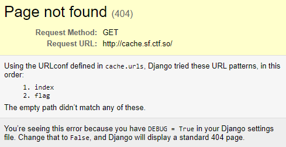
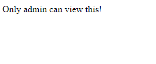
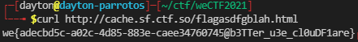

Cache [143 pts]
=================

Solved by: Dayton Hasty ([dayt0n](https://github.com/dayt0n)), Will Green ([Ducky](https://github.com/wlg0005))
---------------------------------------------------------------------------------------------------------------

Challenge Description
---------------------

```
Arrogant Shou thinks Django is the worst web framework and decided to use it like Flask. To support some business logics, he developed some middlewares and added to the Flask-ish Django. One recent web app he developed with this is to display flag to admins. Help us retrieve the flag :)

This challenge requires user interaction. Send your payload to uv.ctf.so

Host 1 (San Francisco): cache.sf.ctf.so
Host 2 (Los Angeles): cache.la.ctf.so
Host 3 (New York): cache.ny.ctf.so
Host 4 (Singapore): cache.sg.ctf.so
```

[Source Code](./src)

Tags: `Troll`

Initial Thoughts
----------------

Before looking at the source code, we can attempt to navigate to the site:



Interesting, debug mode appears to be enabled. Not exactly a vulnerability, but its nice to have. 

Let's try `/index`:


And `/flag`:



This is about what we expected. Just navigating to `/flag` on our own shouldn't be possible anyway... or should it?

Source Code 
-----------

Upon initial inspection, it looked like all we needed to focus on was in the [cache/](./src/cache) directory in the source code. 

The [wsgi.py](./src/cache/wsgi.py) file seemed to be the main program running the whole server. It didn't really tell us too much about how we should go about exploiting the service, though:

```python
import os
from django.core.wsgi import get_wsgi_application
os.environ.setdefault('DJANGO_SETTINGS_MODULE', 'cache.settings')
application = get_wsgi_application()
```

The same went for the [asgi.py](./src/cache/asgi.py) file:

```python
import os
from django.core.asgi import get_asgi_application
os.environ.setdefault('DJANGO_SETTINGS_MODULE', 'cache.settings')
application = get_asgi_application()
```

Both, however, referenced `cache.settings`, which would be the [settings.py](src/cache/settings.py) file:

```python
from pathlib import Path
BASE_DIR = Path(__file__).resolve().parent.parent
SECRET_KEY = 'django-insecure-p*sk-&$*0qb^j3@_b07a38kzus7d^&)-elk6rmoh1&__6yv^bf'
DEBUG = True
ALLOWED_HOSTS = ["*"]
INSTALLED_APPS = []
MIDDLEWARE = [
    'cache.cache_middleware.SimpleMiddleware',
]
ROOT_URLCONF = 'cache.urls'
TEMPLATES = []
WSGI_APPLICATION = 'cache.wsgi.application'
DATABASES = {}
LANGUAGE_CODE = 'en-us'
TIME_ZONE = 'UTC'
USE_I18N = True
USE_L10N = True
USE_TZ = True
STATIC_URL = '/static/'
DEFAULT_AUTO_FIELD = 'django.db.models.BigAutoField'
```

Here, we can see where the server has `DEBUG = True`, which is why we were seeing the Django debug screen earlier. The `SECRET_KEY` is really only used for hashing, which, spoiler alert, doesn't occur in this project. 

The main items to focus on here are `ROOT_URLCONF` and `MIDDLEWARE`. 

`ROOT_URLCONF` points to [urls.py](src/cache/urls.py), which contains the following snippet:

```python
FLAG = os.getenv("FLAG")
ADMIN_TOKEN = os.getenv("ADMIN_TOKEN")

def flag(request: HttpRequest):
    token = request.COOKIES.get("token")
    print(token, ADMIN_TOKEN)
    if not token or token != ADMIN_TOKEN:
        return HttpResponse("Only admin can view this!")
    return HttpResponse(FLAG)

def index(request: HttpRequest):
    return HttpResponse("Not thing here, check out /flag.")

urlpatterns = [
    re_path('index', index),
    re_path('flag', flag)
]
```

We can see the two allowed URLs, `flag` and `index`, and their associated code. `index` doesn't seem to do anything special and it looks like we have to be an admin to get anything useful from `flag`. There also do not seem to be any glaring errors in `flag()` that would allow for any sort of bypass. 

*Note: The [`re_path(str, function)`](https://docs.djangoproject.com/en/3.2/ref/urls/#re-path) call processes `str` as a regex string. Since there are no beginning and end characters in the `flag` and `index` regex strings, as long as the word `flag` or `index` are in a path, the url will resolve accordingly. This means that a request to `/aaaaaaaaindexaaaaa` will send a user to `/index`.*

Next, we turn to the `MIDDLEWARE` attribute in [settings.py](src/cache/settings.py), which seems to point to a class called `SimpleMiddleware` in [cache_middleware.py](./src/cache/cache_middleware.py), as seen in the below snippet:

```python
CACHE = {}  # PATH => (Response, EXPIRE)

class SimpleMiddleware:
    def __init__(self, get_response):
        self.get_response = get_response

    def __call__(self, request: HttpRequest):
        path = urllib.parse.urlparse(request.path).path
        if path in CACHE and CACHE[path][1] > time.time():
            return CACHE[path][0]
        is_static = path.endswith(".css") or path.endswith(".js") or path.endswith(".html")
        response = self.get_response(request)
        if is_static:
            CACHE[path] = (response, time.time() + 10)
        return response
```

Middleware, as defined in [Django's documentation](https://docs.djangoproject.com/en/3.2/topics/http/middleware/), can hook a request to a page and run before the original request code is processed, while also handling the reponse data from the request. 

In this case, before the code in [urls.py](src/cache/urls.py) for `flag` and `index` are run, the `__call__()` method is invoked. 

It appears as though the `__call__()` method grabs the path of the URL, and checks if it is used as a key in the `CACHE` dictionary. If the entry exists, it gets the key value, which seems to be an expiration time, and checks if it has passed. In the case that the expiration time is still not up, the response to the user will be returned from the original response stored in the `CACHE`, skipping the actual page code in [urls.py](src/cache/urls.py) completely. 

To even be added to the `CACHE` in the first place, the URL must end with `.css`, `.js`, or `.html`. Once the response is added, it is available for 10 seconds. 

Solution
--------

The plan of attack is simple.

We can use the admin link checker provided in the description (uv.ctf.so) to have the admin visit the `/flag.[html/css/js]` URL, thus triggering the cache. Then, we can visit it a few seconds later on our local machine to get the cached version before the expiration time or 10 seconds is reached.

Because other people are probably hitting `/flag.[html/css/js]` lot, we will be better off using a unique URL. Because of the earlier note about `re_path(str, function)`, we know that as long as the word `flag` is in the URL, the page will load. 

We first have the admin at uv.ctf.so visit the page http://cache.sf.ctf.so/flagasdfgblah.html.

After about 5 seconds have passed, we are able to get the flag from the cache!



Flag: `we{adecbd5c-a02c-4d85-883e-caee34760745@b3TTer_u3e_cl0uDF1are}`