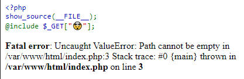
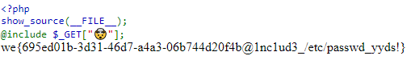

Include [310 pts]
=================

Solved by: Dayton Hasty ([dayt0n](https://github.com/dayt0n))
-------------------------------------------------------------

Challenge Description
---------------------

```
Yet another buggy PHP website.

Flag is at /flag.txt on filesystem

Host 1 (San Francisco): include.sf.ctf.so
Host 2 (Los Angeles): include.la.ctf.so
Host 3 (New York): include.ny.ctf.so
Host 4 (Singapore): include.sg.ctf.so
```

Tags: `Easy`, `PHP`

Solution
--------

After navigating to the site, we are presented with this page:



After taking a look at the [documentation](https://www.php.net/manual/en/function.include.php) for PHP's `include` directive, we see that it takes an argument in the form of a file path. The file is then evaluated. 

Here, the solution ended up being very simple. 

Because the flag file existed at `/flag.txt`, we could force the PHP file to include it by specifying the URL parameter `http://include.sf.ctf.so/?🤯=/flag.txt`. Since there is presumably no code to evaluate at `/flag.txt`, all the program knows to do is to print out what it finds:



Flag: `we{695ed01b-3d31-46d7-a4a3-06b744d20f4b@1nc1ud3_/etc/passwd_yyds!}`