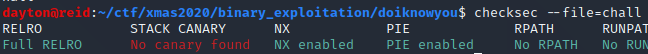

Do I know you?
==============

Solved by: Dayton Hasty ([dayt0n](https://github.com/dayt0n))
-------------------------------------------------------------

Challenge Description
---------------------

```
You walk on the street. This guy seems to recognize you. What do you do?
```

Process
-------

I immediately threw the executable into BinaryNinja to start disassembling it. 

For a moment, I switched windows and ran `checksec` on the binary and got the following output:



At first the results of checksec may seem like this could shape up to be a more involved problem, but for the time being, just remember there is no stack canary.

Popping back over to BinaryNinja, we can see the following decompilation of the `main()` function:


It seems that there is an (unsafe) `gets()` call followed by a check of a variable. If the variable, `var_18` is equal to `0xdeadbeef`, the flag is ours.

Since `var_18` is never actually set, it seems that we need an exploit that will set it. 

We have control over `var_38` via the `gets()` function. The frame offset of `var_18` is `-0x18` while the frame offset for `var_38` is `-0x38`. So, it seems that after filling up the allowed `0x20` (32) bytes of `var_38`, we begin to write to `var_18`, effectively setting it.

So, the payload would consist of sending 32 bytes of filler data then sending a little endian byte string of `0xdeadbeef`. 

I just used python to send this data so the final exploit in testing was:

```bash
python -c "print 'A'*32 + '\xef\xbe\xad\xde\x00\x00'" | ./chall
```

This seemed to work, so I replace `./chall` with the netcat command to connect to the challenge to get the flag:


Flag: `X-MAS{ah_yes__i_d0_rememb3r_you}`