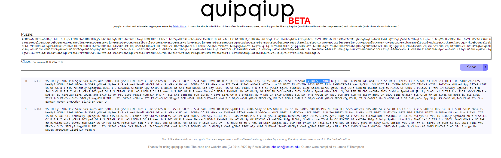
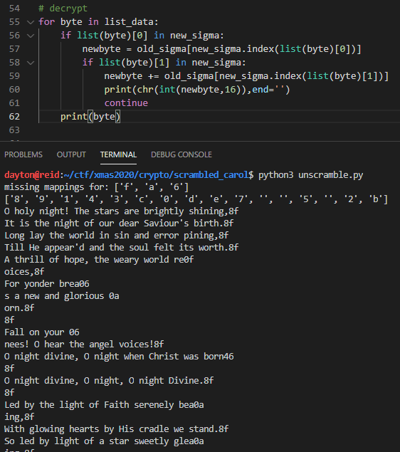
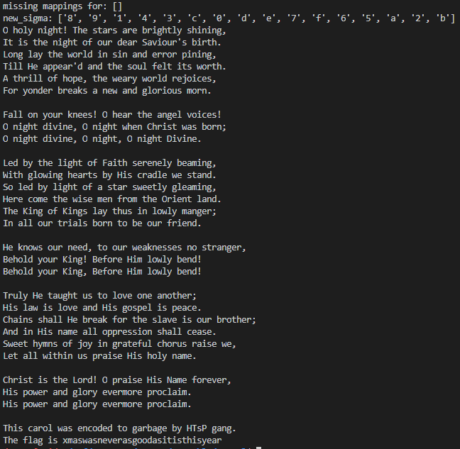

Scrambled Carol
===============

Solved by: Dayton Hasty ([dayt0n](https://github.com/dayt0n))
-------------------------------------------------------------

Challenge Description
---------------------

```
I downloaded this carol a few days ago, and then I started reverse engineering some malware... Somehow my carol got scrambled after that, and next to it appeared some sort of weird script.
Can you help me recover the carol? It was a very good one.
Note: Challenge does not follow the normal flag format. Upload as lowercase.
```

Explanation
-----------

For this challenge, we were provided with 2 files.

The first file was [carol.txt](carol.txt), which contained what looked like a string of hex values:

```
3b180e0b05d71802070d0ed31918c30e0c18d4d309d1d41809d10c1801d1070d0ed305d718d40e070207020d158f.....
```

The other file was a python script called [script.py](script.py), which seemed to read in a file and then encrypt the data with using a string of randomly ordered hex values:

```python
import os
import random

def get_seed(size):
    return int(os.urandom(size).hex(), 16)

input_data = None
output_data = ""

seed = get_seed(4)
random.seed(seed)

old_sigma = "0123456789abcdef"
new_sigma = list(old_sigma)
random.shuffle(new_sigma)
new_sigma = ''.join(new_sigma)
print(old_sigma, new_sigma)

with open("input.txt", "r") as in_file:
    input_data = in_file.read()

for alpha in input_data:
    encoded = (bytes(alpha.encode()).hex())
    output_data += new_sigma[old_sigma.index(encoded[0])]
    output_data += new_sigma[old_sigma.index(encoded[1])]


with open("output.txt", "w") as out_file:
    out_file.write(str(output_data))
```

The gist of what is happening here is that there is a string, `old_sigma`, which contains hex values from `0->f`. The variable `new_sigma` is just a random re-ordering of the values in `old_sigma`.

The encryption process sifts through the data to be encrypted, character by character, and encrypts it by converting the character into its [ASCII](http://www.asciitable.com/) hexadecimal encoding, splitting the byte into 2 [nibbles](https://en.wikipedia.org/wiki/Nibble#Extracting_a_nibble_from_a_byte), gets the index of each nibble in `old_sigma`, then gets the value at that same index in `new_sigma` to add it to the final encrypted output.

To make this easier to understand, let's go through an example.

Say you have the following values for `old_sigma` and `new_sigma`:

```python
old_sigma = "0123456789abcdef"
new_sigma = "f0e1d2c3b4a59678"
```

If the letter 'A' is going to be encrypted, it will first be transformed into its ASCII hexadecimal value of `41`.

Then, the index of each nibble in `old_sigma` must be found. In this situation, the index of `4` is `4` and the index of `1` is `1` in `old_sigma`.

Now, the values at `new_sigma[4]` and `new_sigma[1]` must be retrieved. Here, they are `d` and `0`, respectively. 

So, the final encrypted output is `d0`. 

Solution
--------

To solve this, I believe I probably took the lazy way out...

I decided to write a [short python script](uniquify_cryptogram.py) to translate each pair of characters in [carol.txt](carol.txt) into a unique capital or lowercase latin alphabet character:

```python
with open("carol.txt",'r') as f:
    data = f.read()

list_data = [data[i:i+2] for i in range(0, len(data), 2)]
unique = set(list_data)
mapped = {}
big_str = ''
for c,byte in enumerate(unique):
    add = 65
    if c > 25:
        add = 97
        c -= 25
    mapped.update({byte:chr(c+add)})
for i in list_data:
    big_str += mapped[i]
print(f"{mapped}\n{big_str}")
```

This program spat out a long string with each character's mapping, which looked something like this:

```
{'09': 'A', '15': 'B', '1d': 'C', 'c3': 'D', 'd8': 'E', '0c': 'F', '05': 'G', 'd7': 'H', '39': 'I', '06': 'J', '3e': 'K', 'cd': 'L', '0f': 'M', 'd4': 'N', '0a': 'O', '01': 'P', '34': 'Q', 'de': 'R', 'dc': 'S', '03': 'T', 'd3': 'U', 'd0': 'V', 'c4': 'W', '00': 'X', '30': 'Y', '3b': 'Z', '8f': 'b', '31': 'c', '19': 'd', '35': 'e', '02': 'f', '18': 'g', '0b': 'h', '0d': 'i', '33': 'j', '12': 'k', '0e': 'l', '46': 'm', '32': 'n', '37': 'o', '36': 'p', 'dd': 'q', '04': 'r', '07': 's', 'd1': 't', 'c8': 'u'}
ZglhGHgfsilUdgDlFgNUAtNgAtFgPtsilUGHgNlsfsfiBboUgsNgUlFgfsilUghXghStgTFAtgWAVshStCNgPstUlkbehfigGAHgUlFgqhtGTgsfgNsfgAfTgFtthtgEsfsfiBbDsGGgKFgAEEFAtCTgAfTgUlFgNhSGgXFGUgsUNgqhtUlkbIgUltsGGghXglhEFBgUlFgqFAtHgqhtGTgtFMhsrFNBbYhtgHhfTFtgPtFAJNgAgfFqgAfTgiGhtshSNgOhtfkbbYAGGghfgHhStgJfFFNdgZglFAtgUlFgAfiFGgVhsrFNdbZgfsilUgTsVsfFBgZgfsilUgqlFfgQltsNUgqANgPhtfmbZgfsilUgTsVsfFBgZgfsilUBgZgfsilUgjsVsfFkbbeFTgPHgUlFgGsilUghXgYAsUlgNFtFfFGHgPFAOsfiBbLsUlgiGhqsfiglFAtUNgPHgKsNgrtATGFgqFgNUAfTkbWhgGFTgPHgGsilUghXgAgNUAtgNqFFUGHgiGFAOsfiBbKFtFgrhOFgUlFgqsNFgOFfgXthOgUlFgZtsFfUgGAfTkbDlFgpsfighXgpsfiNgGAHgUlSNgsfgGhqGHgOAfiFtmbofgAGGghStgUtsAGNgPhtfgUhgPFghStgXtsFfTkbbKFgJfhqNghStgfFFTBgUhghStgqFAJfFNNFNgfhgNUtAfiFtBbcFlhGTgHhStgpsfidgcFXhtFgKsOgGhqGHgPFfTdbcFlhGTgHhStgpsfiBgcFXhtFgKsOgGhqGHgPFfTdbbDtSGHgKFgUASilUgSNgUhgGhVFghfFgAfhUlFtmbKsNgGAqgsNgGhVFgAfTgKsNgihNEFGgsNgEFArFkbQlAsfNgNlAGGgKFgPtFAJgXhtgUlFgNGAVFgsNghStgPthUlFtmbIfTgsfgKsNgfAOFgAGGghEEtFNNshfgNlAGGgrFANFkbWqFFUglHOfNghXgMhHgsfgitAUFXSGgrlhtSNgtAsNFgqFBbeFUgAGGgqsUlsfgSNgEtAsNFgKsNglhGHgfAOFkbbQltsNUgsNgUlFgehtTdgZgEtAsNFgKsNgnAOFgXhtFVFtBbKsNgEhqFtgAfTgiGhtHgFVFtOhtFgEthrGAsOkbKsNgEhqFtgAfTgiGhtHgFVFtOhtFgEthrGAsOkgbbDlsNgrAthGgqANgFfrhTFTgUhgiAtPAiFgPHgKDNugiAfikbDlFgXGAigsNgROANqANfFVFtANihhTANsUsNUlsNHFAtb
```

With the knowledge that this was a Christmas carol, I took the long string and threw it into a cryptanalysis engine, specifically [quipquip](quipquip.com) using the patristocrat setting:



(side note: at some point this week, quipquip was updated to beta2, which doesn't seem to work, at least for me, with a mixture of upper and lower case letters.)

As you can see, multiple words appeared in the results, including "errors pining". For some reason this sounded familiar so I just did a Google search for "christmas carol errors pining".

The search seemed to indicate that the carol was "[O Holy Night](https://genius.com/Christmas-songs-o-holy-night-lyrics)". While the original lyric is "error pining", I figured this was close enough and I was onto something.

From this point, it was just a matter of decoding and reversing the mapping of each pair of characters in the encrypted text to a letter from the song. 

After I had mapped out enough `new_sigma` and `old_sigma` hexadecimal character pairs, I ran a script which attempted to build up the original `new_sigma` to try and form the final, unencrypted, piece of data:



It took a few trial runs and inference to get every letter mapped, but the [final script](unscramble.py) ended up looking like this:

```python
def diff_lists(li1, li2):
    return (list(list(set(li1)-set(li2)) + list(set(li2)-set(li1))))

# known new_sigma -> old_sigma mappings
knowns = {
    "3b": "4f", # O
    "18": "20", # ' '
    "0e": "68", # h
    "0b": "6f", # o
    "05": "6c", # l
    "d7": "79", # y
    "02": "6e", # n
    "07": "69", # i
    "0d": "67", # g
    "d3": "74", # t
    "19": "21", # !
    "c3": "54", # T
    "0c": "65", # e
    "d4": "73", # s
    "09": "61", # a
    # everything below was added after near decryption through guessing/reading carol online
    "0f": "6a", # j
    "06": "6b", # k
    "0a": "6d"  # m
}
old_sigma = "0123456789abcdef"
new_sigma = ['','','','','','','','','','','','','','','','']
# read in file
with open("carol.txt",'r') as f:
    data = f.read()
# break data up into pairs
list_data = [data[i:i+2] for i in range(0, len(data), 2)]
# generate new_sigma
for byte in list_data:
    if byte in knowns.keys():
        mapped = knowns[byte]
        new_sigma[old_sigma.index(list(mapped)[0])] = list(byte)[0]
        new_sigma[old_sigma.index(list(mapped)[1])] = list(byte)[1]
print(f"missing mappings for: {diff_lists(new_sigma,list(old_sigma))[-1:]}")
print(f"new_sigma: {new_sigma}")

# decrypt
for byte in list_data:
    if list(byte)[0] in new_sigma:
        newbyte = old_sigma[new_sigma.index(list(byte)[0])]
        if list(byte)[1] in new_sigma:
            newbyte += old_sigma[new_sigma.index(list(byte)[1])]
            print(chr(int(newbyte,16)),end='')
            continue
    print(byte) # if pair wasn't decrypted
```

The final result was: 



Flag: `xmaswasneverasgoodasitisthisyear`