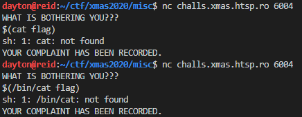
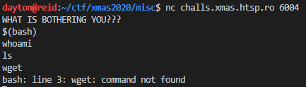

Complaint
=========

Solved by: Dayton Hasty ([dayt0n](https://github.com/dayt0n))
-------------------------------------------------------------

Challenge Description
---------------------

```
Do you want to file a formal complaint? Use this address and we'll take care of redirecting it to /dev/null.
```

Solution
--------

After connecting to the challenge instance, I was presented with a prompt where data could be entered.

Because the challenge mentioned that all complaints would be forwarded to /dev/null, I figured the program running on the server is probably doing something like:

```bash
echo [USER INPUT HERE] > /dev/null
```

So, this was starting to look like a command injection challenge. I decided to try [bash command substitution](https://linuxhint.com/bash_shell_brace_parameter_expansion/):



Unfortunately, it seemed like the `cat` command wasn't going to do any good. I tried the same thing with `head` and `tail`, but didn't have any luck there either.

I tried running `$(bash)` and was able to get a shell, but could only read output that was sent to `stderr`:



Since I could only really get `XXXXXXX: command not found`, I guessed that the flag was at flag.txt and fed the contents of flag.txt into bash across `stdin`:

```bash
$(bash < flag.txt)
```

This printed out the contents of flag.txt as an error message.


Flag: `X-MAS{h3ll0_k4r3n-8819d787dd38a397}`