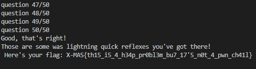

Biggest Lowest
===============

Solved by: Dayton Hasty ([dayt0n](https://github.com/dayt0n))
-------------------------------------------------------------

Challenge Description
---------------------

```
I see you're eager to prove yourself, why not try your luck with this problem?
```

Solution
--------

On connection to the remote challenge, we are presented with a prompt such as this:

```
So you think you have what it takes to be a good programmer?
Then solve this super hardcore task:
Given an array print the first k1 smallest elements of the array in increasing order and then the first k2 elements of the array in decreasing order.
You have 50 tests that you'll gave to answer in maximum 45 seconds, GO!
Here's an example of the format in which a response should be provided:
1, 2, 3; 10, 9, 8

Test number: 1/50
array = [4, 8, 1, 2, 2]
k1 = 2
k2 = 4
```

After reading the challenge, the solution seems to be fairly basic.

Steps:
  1. sort the array in ascending order
  2. get the first k1 elements from the sorted array
  3. sort the array in descending order
  4. get the first k2 elements from the sorted array
  5. format and send results

To solve this challenge, we can use [pwntools](https://github.com/Gallopsled/pwntools) in a [python script](solve.py) to connect to the remote instance and read in the data:

```python
from pwn import *

# connect to remote challenge instance
conn = remote('challs.xmas.htsp.ro',6051)
cont = True
count = 1
while cont:
    # get data
    dat = conn.recvuntil('array =')
    print(f"question {count}/50")
    if b"50/50" in dat:
        cont = False # this is the last question
    # parse data
    arr = conn.recvuntil('=').decode().split('\n')[0].strip().replace('[','').replace(']','')
    k1 = conn.recvuntil('=').decode().split('\n')[0]
    k2 = conn.recvuntil('\n').decode().strip()
    nums = [int(n) for n in arr.split(',')]
    # 1. sort array in ascending order
    nums.sort()
    # 2. get first k1 elements of sorted array
    first_question = nums[:int(k1)]
    # 3. sort array in descending order
    nums.sort(reverse=True)
    # 4. get first k2 elements of sorted array
    second_question = nums[:int(k2)]
    # 5. format result
    result = ', '.join(str(n) for n in first_question) + '; ' + ', '.join(str(n) for n in second_question)
    conn.sendline(result.encode()) # send
    count += 1
final = conn.recv().decode() # get flag after all questions are answered
print(final)
conn.close()
```

After running, we get the flag:



Flag: `X-MAS{th15_i5_4_h34p_pr0bl3m_bu7_17'5_n0t_4_pwn_ch41l}`