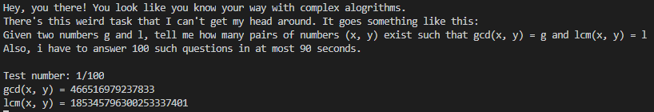
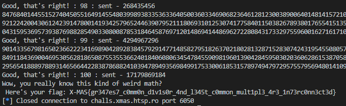

Biggest Lowest
===============

Solved by: Dayton Hasty ([dayt0n](https://github.com/dayt0n)), Calen Stewart, Brian Towne
-----------------------------------------------------------------------------------------

Challenge Description
---------------------

```
Today in Santa's course in Introduction to Algorithms, Santa told us about the greatest common divisor and the least common multiple.
He this gave the following problem as homework and I don't know how to solve it.
Can you please help me with it?
```

Initial Information
-------------------

On connection to the remote challenge, we are presented with the following prompt:



Before jumping straight to the solution, let's review a few mathematical concepts that will come in handy.

Background
----------

### Least Common Multiple

The least common multiple ([LCM](https://en.wikipedia.org/wiki/Least_common_multiple)) of two numbers, `x` and `y`, is the smallest number that is shared between the multiples of `x` and `y`. 

For instance, say `x = 4` and `y = 6`. We can start by listing out the multiples of each number:

```
multiples of 4: 4, 8,  12, 16, 20, 24, ...
multiples of 6: 6, 12, 18, 24, 30, 36, ...
```

In this case, `LCM(x,y) = 12` since 12 is the smallest number that occurs in both lists of multiples.

### GCD

The greatest common divisor ([GCD](https://en.wikipedia.org/wiki/Greatest_common_divisor)) of two numbers, `x` and `y`, is the largest positive integer that divides both `x` and `y`. 

For example, say `x = 4` and `y = 6`. We can use each number's [prime power decomposition](http://mathonline.wikidot.com/prime-power-decomposition) to find the GCD. The basis behind the idea of prime power decomposition is that **every** integer can be represented as a product of primes raised to a power. 

So, the prime power decompositions for `x` and `y`  in this case are as follows:

decomposition of 4: 2<sup>2</sup>

decomposition of 6: 2<sup>1</sup> × 3<sup>1</sup>

Now, we know `GCD(x,y) = 2` because 2<sup>1</sup> goes into both decompositions (2<sup>1</sup> divides 2<sup>2</sup>). This works for larger numbers with more prime factors as well. 

### How To Relate GCD to LCM

This challenge requires knowing how to find `x` and `y` given an LCM and GCD.

Using an example, say you are given the following information:

```
LCM(x,y) = 12
GCD(x,y) =  4 
```

First, let's obtain the prime power decompositions of `12` and `4`:

decomposition of LCM: &nbsp; 2<sup>2</sup> × 3<sup>1</sup>

decomposition of GCD: &nbsp; 2<sup>2</sup>

After determining the prime power decomposition of both LCM and GCD, figuring out how many pairs of numbers (`x`,`y`) that satisfy both `LCM(x,y) = 12` and `GCD(x,y) =  4` is quite simple.

Let us make a new "variable" called `GL`. Say `GL` initially contains the prime power decomposition of `LCM(x,y) = 12`.

For each prime/power pair in `GL`, if the same prime/power pair exists in the decomposition of `GCD(x,y) =  4`, remove it from `GL`. 

In our case of `LCM(x,y) = 12` and `GCD(x,y) =  4`, we can now say:

LCM decomposition: &nbsp; 2<sup>2</sup> × 3<sup>1</sup>

GCD decomposition: &nbsp; 2<sup>2</sup>

&nbsp; &nbsp;GL decomposition: &nbsp; 3<sup>1</sup>

We can now say that the number of pairs of (`x`,`y`) that exist such that `LCM(x,y) = 12` and `GCD(x,y) =  4` is equal to 2<sup>len(GL)</sup>.

In this case, the number of pairs would be: 2<sup>1</sup> = 2.

If you still need more expanation on the relationship between LCM and GCD, be sure to check out [this video](https://www.youtube.com/watch?v=tqe1ZjxWCRw).

Solution
--------

First, we will need to setup a program that can parse and read the LCM and GCD values using [pwntools](https://github.com/Gallopsled/pwntools):

```python
from pwn import *

# connect to remote challenge
conn = remote('challs.xmas.htsp.ro',6050)
count = 0 # question counter
while True:
    conn.recvuntil('\ngcd(x, y) = ')
    g = int(conn.recvuntil('\n').rstrip()) # get gcd
    conn.recvuntil('lcm(x, y) = ')
    l = int(conn.recvuntil('\n').rstrip()) # get lcm
    #
    # do calculations here
    #
    try:
        ret = conn.recvline().decode()
        if count == 100:
            print(conn.recv().decode().strip()) # should have the flag
            break
        if "That is not the correct answer!" in ret:
            print(ret.strip())
            break
    except(EOFError):
        print(f"Times up, got to {count}/100!")
        break
conn.close()
```

Using the previously stated algorithm of finding unique prime/power pairs in LCM relative to GCD, we know that if `LCM == GCD`, all prime/power pairs will be cancelled out of `GL`, so the result will be 2<sup>0</sup> = 1. 

Because of this, there is no reason to do all the computational work of factoring LCM or GCD if they are equal. So, we can just have a piece of code before any calculations take place to check if they are equal so we can send a `1`, indicating a singular solution:

```python
if l == g: # don't waste time decomposing if equal
    conn.sendline(b'1')
    ret = conn.recvline().decode()
    if "That is not the correct answer!" in ret:
        break
    continue
```

I was a bit lazy and did not want to write code to determine prime factors, so I started out using [this snippet from Rosetta Code](https://rosettacode.org/wiki/Prime_decomposition#Python:_Using_floating_point):

```python
def fac(n):
    step = lambda x: 1 + (x<<2) - ((x>>1)<<1)
    maxq = int(floor(isqrt(n)))
    d = 1
    q = 2 if n == ((n>>1)<<1) else 3
    while q <= maxq and n % q:
        q = step(d)
        d += 1
    return [q] + fac(n // q) if q <= maxq else [n]
```

To get the decomposition from a list of prime factors, it is just a matter of counting how many times each prime factor appears in the factored `n`:

```python
def get_decomp(n):
    factors = fac(n)
    decomp = []
    for i in set(factors):
        decomp.append({"coef":i,"exp":factors.count(i)})
    return decomp
```

Each time a new question is given by the challenge, the LCM and GCD seem to get larger and larger. To avoid having to spend the time factoring both the LCM and the GCD individually, we can just find the decomposition of LCM then check to see if the each prime `p` in a prime/power pair p<sup>n</sup> divides GCD exactly `n` times. If it does, the prime/power pair can be removed. This can be implemented as such:

```python
# a prime power decomposition here is represented as a list 
# of dictionaries
# example: decomp of 6: (2^1) * (3^1)
#   as list: [{'coef': 2, 'exp': 1}, {'coef': 3, 'exp': 1}]
def reduce_lcm(lcm_decomp,gcd):
    gl_decomp = []
    for factor in lcm_decomp:
        if not gcd % factor["coef"]:
            count = 0
            div = gcd
            while 1:
                count += 1
                div //= factor["coef"]
                if div % factor["coef"]:
                    break
            if count == factor["exp"]:
                continue # don't add this to new_ldecomp
        gl_decomp.append(factor)
    return gl_decomp
```

After the previously mentioned `LCM == GCD` check, all we have to do is call `get_decomp(lcm)` and feed the result of that function into `reduce_lcm(lcm_decomp,gcd)`:

```python
lcm_decomp = get_decomp(lcm)
gl_decomp = reduce_lcm(lcm_decomp,gcd)
```

Since we are concerned with speed here, instead of doing 2<sup>len(gl_decomp)</sup> to get the number of `x` and `y` pairs, we can just shift `1` left `len(gl_decomp)` times. 

The resulting main part of the program that solved the challenge was:

```python
# connect to remote challenge
conn = remote('challs.xmas.htsp.ro',6050)
count = 0 # question counter
while True:
    conn.recvuntil('\ngcd(x, y) = ')
    gcd = int(conn.recvuntil('\n').rstrip()) # get gcd
    conn.recvuntil('lcm(x, y) = ')
    lcm = int(conn.recvuntil('\n').rstrip()) # get lcm
    print(lcm)
    count += 1
    if lcm == gcd: # don't waste time decomposing if equal
        conn.sendline(b'1')
        ret = conn.recvline().decode()
        if "That is not the correct answer!" in ret:
            break
        continue
    lcm_decomp = get_decomp(lcm) # get prime power decomp of lcm
    gl_decomp = reduce_lcm(lcm_decomp,gcd) # prune lcm decomp
    conn.sendline(str(1 << len(gl_decomp)).encode()) # send 2^len(gl_decomp)
    try:
        ret = conn.recvline().decode()
        print(ret.strip() + " : " + str(count) + f" : sent - {1 << len(gl_decomp)}")
        if count == 100:
            print(conn.recv().decode().strip())
            break
        if "That is not the correct answer!" in ret:
            print(ret.strip())
            break
    except(EOFError):
        print(f"Times up, got to {count}/100!")
        break
conn.close()
```

In theory, this should work. And it did... up until about question number 50/100. As the numbers got larger, factoring took longer and 90 seconds were up. 

It seemed that the majority of the program execution time was being taken up by the factorization process. 

This could be attributed to:
  
  1. The factoring algorithm is not efficient enough
  2. The computer used to solve the challenge is just too slow in general
  3. Using Python for computationally expensive math problems such as prime factorization is *bad*

Because the answers to the questions were being correctly solved, all that needed to occur was to offload the factorization to a faster programming language. 

C++ seemed like the way to go here. This would allow for a significant increase in speed as well as the ability to deal with arbitrarily large integers through the use of the [GMP](https://gmplib.org/manual/C_002b_002b-Interface-General) library.

Below is the C++ code used for prime factorization of large numbers, slightly modified from [another Rosetta Code example](https://rosettacode.org/wiki/Prime_decomposition#C.2B.2B):

```c++
#include <iostream>
#include <gmpxx.h>

template<typename Integer, typename OutputIterator>
 void decompose(Integer n, OutputIterator out)
{
    Integer i(2);
 
    while (n != 1)
    {
        while (n % i == Integer(0))
        {
            *out++ = i;
            n /= i;
        }
        ++i;
    }
}

template<typename T> class infix_ostream_iterator:
    public std::iterator<T, std::output_iterator_tag>
{
    class Proxy;
    friend class Proxy;
    class Proxy
    {
    public:
        Proxy(infix_ostream_iterator& iter): iterator(iter) {}
        Proxy& operator=(T const& value)
        {
            if (!iterator.first)
            {
                iterator.stream << iterator.infix;
            }
            iterator.stream << value;
        }
    private:
        infix_ostream_iterator& iterator;
    };
public:
    infix_ostream_iterator(std::ostream& os, char const* inf):
        stream(os),
        first(true),
        infix(inf)
    {
    }
    infix_ostream_iterator& operator++() { first = false; return *this; }
    infix_ostream_iterator operator++(int)
    {
        infix_ostream_iterator prev(*this);
        ++*this;
        return prev;
    }
    Proxy operator*() { return Proxy(*this); }
private:
    std::ostream& stream;
    bool first;
    char const* infix;
};
 
int main(int argc, char* argv[])
{
    if (argc < 2) {
        std::cout << "Incorrect usage\n";
        return -1;
    }
    mpz_class number;
    number = argv[1];
 
    if (number <= 0)
        std::cout << "this number is not positive!\n";
    else {
        decompose(number, infix_ostream_iterator<mpz_class>(std::cout, ","));
        std::cout << "\n";
    }
}
```

After compiling this code, all that needed to be done in the Python script was to replace every instance of the `fac(n)` function with a new function:

```python
def real_fast_factor(n):
    # real sorry for this one
    result = subprocess.run(['./more_primes',str(n)],stdout=subprocess.PIPE)
    return [int(res) for res in result.stdout.decode().strip().split(',')]
```

The [final script](solve.py) that was used to solve the challenge was:

```python
from pwn import *
from math import floor, isqrt
import subprocess

# https://rosettacode.org/wiki/Prime_decomposition#Python:_Using_floating_point 
# ended up not using this
def fac(n):
    step = lambda x: 1 + (x<<2) - ((x>>1)<<1)
    maxq = int(floor(isqrt(n)))
    d = 1
    q = 2 if n == ((n>>1)<<1) else 3
    while q <= maxq and n % q:
        q = step(d)
        d += 1
    return [q] + fac(n // q) if q <= maxq else [n]

def real_fast_factor(n):
    # we out here
    # being lazy
    result = subprocess.run(['./more_primes',str(n)],stdout=subprocess.PIPE)
    return [int(res) for res in result.stdout.decode().strip().split(',')]

def get_decomp(n):
    factors = real_fast_factor(n) # fac(n)
    decomp = []
    for i in set(factors):
        decomp.append({"coef":i,"exp":factors.count(i)})
    return decomp

def reduce_lcm(lcm_decomp,gcd):
    gl_decomp = []
    for factor in lcm_decomp:
        if not gcd % factor["coef"]:
            count = 0
            div = gcd
            while 1:
                count += 1
                div //= factor["coef"]
                if div % factor["coef"]:
                    break
            if count == factor["exp"]:
                continue # don't add this to new_ldecomp
        gl_decomp.append(factor)
    return gl_decomp

# connect to remote challenge
conn = remote('challs.xmas.htsp.ro',6050)
count = 0 # question counter
while True:
    conn.recvuntil('\ngcd(x, y) = ')
    gcd = int(conn.recvuntil('\n').rstrip()) # get gcd
    conn.recvuntil('lcm(x, y) = ')
    lcm = int(conn.recvuntil('\n').rstrip()) # get lcm
    print(lcm)
    count += 1
    if lcm == gcd: # don't waste time decomposing if equal
        conn.sendline(b'1')
        ret = conn.recvline().decode()
        if "That is not the correct answer!" in ret:
            break
        continue
    lcm_decomp = get_decomp(lcm) # get prime power decomp of lcm
    gl_decomp = reduce_lcm(lcm_decomp,gcd) # prune lcm decomp
    conn.sendline(str(1 << len(gl_decomp)).encode()) # send 2^len(gl_decomp)
    try:
        ret = conn.recvline().decode()
        print(ret.strip() + " : " + str(count) + f" : sent - {1 << len(gl_decomp)}")
        if count == 100:
            print(conn.recv().decode().strip())
            break
        if "That is not the correct answer!" in ret:
            print(ret.strip())
            break
    except(EOFError):
        print(f"Times up, got to {count}/100!")
        break
conn.close()
```

After running, we get the flag:



Flag: `X-MAS{gr347es7_c0mm0n_d1v1s0r_4nd_l345t_c0mmon_mult1pl3_4r3_1n73rc0nn3ct3d}`