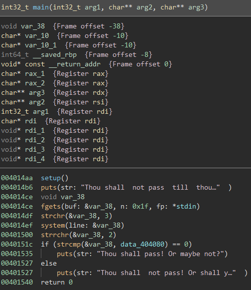
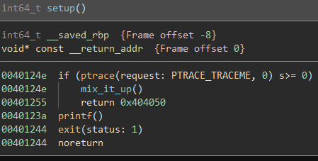
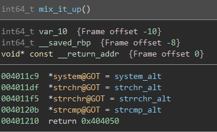
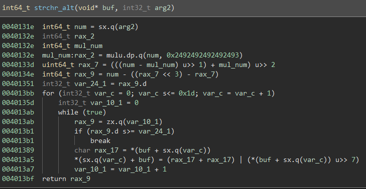
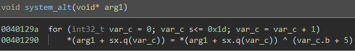
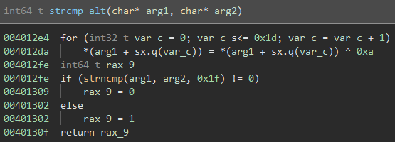
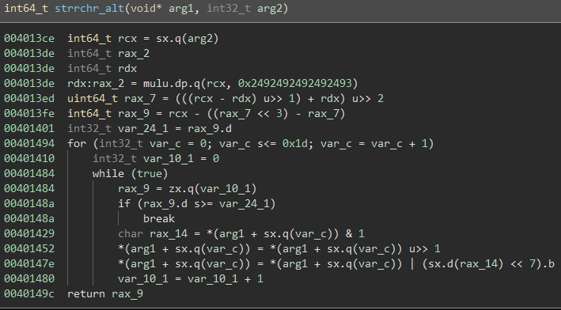
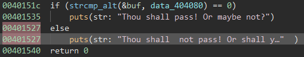
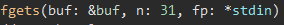
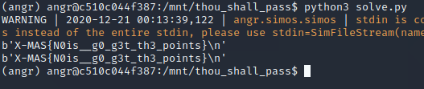

Thou Shall Pass?
================

Solved by: Dayton Hasty ([dayt0n](https://github.com/dayt0n))
-------------------------------------------------------------

Challenge Description
---------------------

```
For thou to pass, the code might not but be entered
```

Observations
-------------

I started out by throwing the executable provided into Binary Ninja and opened the `main()` function:



(side note: this binary was stripped, so all of these function names were created manually as a part of the reversing process)

The first thing that gets executed is a `setup()` function which looks like this:



Seems like there is a `ptrace` anti-debugging catch here, but for now it can be left unpatched.

Since the only call made if debugging is not occuring is `mix_it_up()`, let's check it out:



It looks like this function replaces the addresses of common functions  `system()`, `strchr()`, `strrchr()`, and `strcmp()` with the addresses of local functions. This means any call we see to any of these functions are actually to `system_alt()`, `strchr_alt()`, `strrchr_alt()`, and `strcmp_alt()`.

Looking back at `main()`, there are a few calls to these functions that end up determining whether or not the input was correct.

Let's take a look at these functions:

`strchr_alt()`:



`system_alt()`:



`strcmp_alt()`:



`strrchr_alt()`:



So... that is going to be a lot to reverse.

It would be a lot easier to solve if we had some kind of automated binary analysis platform...

Enter: [angr](https://github.com/angr/angr)

Solution
--------

[angr](https://github.com/angr/angr) can help us run through the program to find what input can get us to where we want to be in the binary. 

A simple angr program works by supplying the address(es) in the binary that we want to get to and the address(es) we want to avoid.

In this case, we want to get to the `puts()` after the `else` in `main()`:



In our case, the address we want to avoid is the first `puts()` at `0x00401535` and the address we want to get to the second `puts()` after `else` at `0x00401527`.

We know from the `fgets()` call in `main()` that our input is going to be 30 bytes, excluding the null byte at the end of the string:



The solution script was based off of [this solution](https://ctftime.org/writeup/23030) to a a Google CTF challenge earlier this year.

The python script used to solve this challenge is as follows:

```python
import angr
import claripy

success_addr = 0x00401527 # address of puts("Thou shall  not pass! Or shall you? ")
fail_addr = 0x00401535    # address of puts("Thou shall pass! Or maybe not?")

flag_len = 30 # 31 buffer, but last is a null byte

proj = angr.Project("./thou_shall_pass_patched")
# thank you GoogleCTF 2020
inp = [claripy.BVS('flag_%d' %i, 8) for i in range(flag_len)]
flag = claripy.Concat(*inp + [claripy.BVV(b'\n')])

st = proj.factory.full_init_state(args=["./thou_shall_pass_patched"], stdin=flag)
for k in inp:
    # limit to ASCII special characters/letters/numbers
    st.solver.add(k < 0x7f)
    st.solver.add(k > 0x20)

sm = proj.factory.simulation_manager(st)
sm.explore(find=success_addr,avoid=fail_addr)
if len(sm.found) > 0:
    for found in sm.found: # print what worked
        print(found.posix.dumps(0))
```

After running, we get the flag:



Flag: `X-MAS{N0is__g0_g3t_th3_points}`