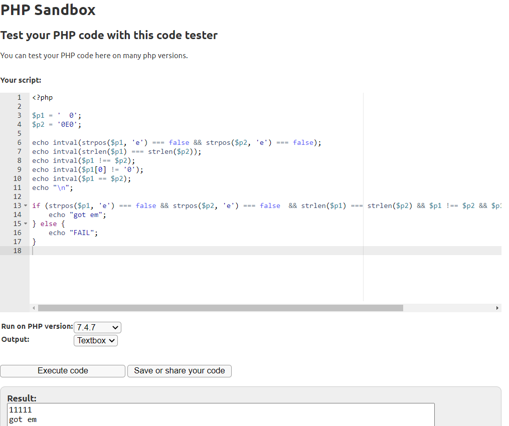
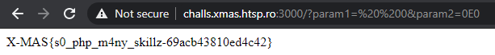

PHP Master
=========

Solved by: Dayton Hasty ([dayt0n](https://github.com/dayt0n))
-------------------------------------------------------------

Challenge Description
---------------------

```
Another one of *those* challenges.
```

Analysis
--------

When we visit the challenge instance, we are presented with some PHP code:

```php
<?php

include('flag.php');

$p1 = $_GET['param1'];
$p2 = $_GET['param2'];

if(!isset($p1) || !isset($p2)) {
    highlight_file(__FILE__);
    die();
}

if(strpos($p1, 'e') === false && strpos($p2, 'e') === false  && strlen($p1) === strlen($p2) && $p1 !== $p2 && $p1[0] != '0' && $p1 == $p2) {
    die($flag);
}

?>
```

Here, the program accepts two `HTTP GET` parameters, `param1` and `param2` which can be set by visiting the challenge URL as such:

```
http://challs.xmas.htsp.ro:3000/?param1=....&param2=.....
```

The first thing we notice is the large sequence of comparisons. For those less experienced in PHP challenges, one of the most common security pitfalls is not using the correct comparison operators when comparing values.

In PHP, if you want to test if two values are equal, you can do so with one of two operators. The `===` operator compares the two operands based on both content and type while the `==` operator only compares the operands based on content.

Misusing the `==` operator is what is referred to as [type juggling](https://medium.com/swlh/php-type-juggling-vulnerabilities-3e28c4ed5c09). This means that while `0 === "0"` evaluates to `false`, `0 == "0"` will evaluate to `true`. 

Solution
--------

Let's start by walking through the large `if` statement that we need to make `true`:

Part 1:

```php
strpos($p1, 'e') === false && strpos($p2, 'e') === false
```

The first pair of comparisons checks to see if the letter 'e' is in either `param1` or `param2`. This is most likely due to the way numbers written in scientific notation (`1e10`) can be used to confuse `==` operators. 

Part 2:

```php
strlen($p1) === strlen($p2)
```

This is just checking to make sure that the two parameters are the same length as strings. 

Part 3:

```php
$p1[0] != '0'
```

The first character of `param1` cannot be '0'.

Part 4:

```php
$p1 !== $p2 && $p1 == $p2
```

This goes back to the previously mentioned discrepancy between the triple equals and double equals operators. To satisfy `$p1 == $p2`, after type juggling, both `param1` and `param2` must hold the same value. However, due to the `$p1 !== $p2` statement, `param1` and `param2` must be different when they are represented as the same type (a string).

We can play around with different values for `param1` and `param2` by copying and pasting the code into an [online PHP sandbox](https://sandbox.onlinephpfunctions.com/).

Looking closely at the first comparison with the checks for 'e', we notice that a capital 'E' is never checked. This means we can still get away with representing a number in a string using scientific notation.

If we want to take the easy way out, all that needs to be done is to have both `param1` and `param2` equal a number such as '0' represented in different ways.

A caveat to this method is that each parameter must have the same length in string form. However, by inserting spaces, PHP will ignore them when doing any sort of direct comparison but count them in a `strlen()` call. 

The final values ended up being:

```php
$param1 = "  0";
$param2 = "0E0";
```

Because there is a check to see if the first value of `param1` is '0', we can just insert the spaces before the final '0' in the string. Both strings are 3 characters long. When type juggling is not used (`!==`), the two variables do not equal each other. However, when type juggling **is** used, the two variables are just interpretted as the integer `0` so `$p1 == $p2` evaluates to true. 

The final PHP sandbox code looked like this:



The payload URL was:

```
http://challs.xmas.htsp.ro:3000/?param1=%20%200&param2=0E0
```

After using these values, we get the flag:



Flag: `X-MAS{s0_php_m4ny_skillz_69acb43810ed4c42}`