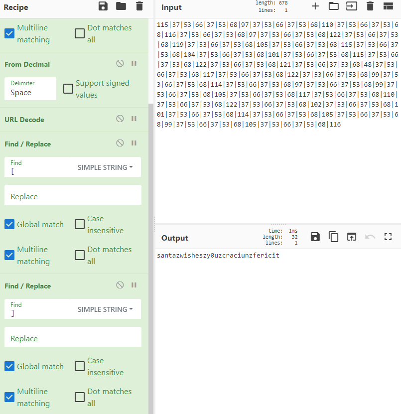

Santa's Consolation
===================

Solved by: Dayton Hasty ([dayt0n](https://github.com/dayt0n))
-------------------------------------------------------------

Challenge Description
---------------------

```
Santa's been sending his regards; he would like to know who will still want to hack stuff after his CTF is over.

Note: Bluuk is a multilingual bug bounty platform that will launch soon and we've prepared a challenge for you. Subscribe and stay tuned!
Target: https://bluuk.io

PS: The subscription form is not the target :P
```

Introduction
------------

After visiting the target, we see a button to activate the challenge:


After opening Inspect Element and looking around a bit, we can find a [challenge.js](challenge.js) file that we can make calls to from the Console:


Due to all of the `atob()`, `split()`, `reverse()`, etc calls being made here, this challenge seemed like it was shaping up to be a sort of web reversing challenge.

Solution
--------

We can start by noting that the `win(x)` function takes a string as the sole parameter, which it then passes on to `check(s)`.

Inside of `check(s)`, it appears `k` is a base64 string as it has [atob()](https://www.w3schools.com/jsref/met_win_atob.asp) called on it, which decodes a base64 string. The full value of `k` was:

```
MkVUTThoak44TlROOGR6TThaak44TlROOGR6TThWRE14d0hPMnczTTF3M056d25OMnczTTF3M056d1hPNXdITzJ3M00xdzNOenduTjJ3M00xdzNOendYTndFRGY0WURmelVEZjNNRGYyWURmelVEZjNNRGYwRVRNOGhqTjhOVE44ZHpNOFpqTjhOVE44ZHpNOEZETXh3SE8ydzNNMXczTnp3bk4ydzNNMXczTnp3bk13RURmNFlEZnpVRGYzTURmMllEZnpVRGYzTURmeUlUTThoak44TlROOGR6TThaak44TlROOGR6TThCVE14d0hPMnczTTF3M056d25OMnczTTF3M056dzNOeEVEZjRZRGZ6VURmM01EZjJZRGZ6VURmM01EZjFBVE04aGpOOE5UTjhkek04WmpOOE5UTjhkek04bFRPOGhqTjhOVE44ZHpNOFpqTjhOVE44ZHpNOGRUTzhoak44TlROOGR6TThaak44TlROOGR6TThSVE14d0hPMnczTTF3M056d25OMnczTTF3M056d1hPNXdITzJ3M00xdzNOenduTjJ3M00xdzNOenduTXlFRGY0WURmelVEZjNNRGYyWURmelVEZjNNRGYzRVRNOGhqTjhOVE44ZHpNOFpqTjhOVE44ZHpNOGhETjhoak44TlROOGR6TThaak44TlROOGR6TThGak14d0hPMnczTTF3M056d25OMnczTTF3M056d25NeUVEZjRZRGZ6VURmM01EZjJZRGZ6VURmM01EZjFFVE04aGpOOE5UTjhkek04WmpOOE5UTjhkek04RkRNeHdITzJ3M00xdzNOenduTjJ3M00xdzNOendITndFRGY0WURmelVEZjNNRGYyWURmelVEZjNNRGYxRVRNOGhqTjhOVE44ZHpNOFpqTjhOVE44ZHpNOFZETXh3SE8ydzNNMXczTnp3bk4ydzNNMXczTnp3WE94RURmNFlEZnpVRGYzTURmMllEZnpVRGYzTURmeUlUTThoak44TlROOGR6TThaak44TlROOGR6TThkVE84aGpOOE5UTjhkek04WmpOOE5UTjhkek04WlRNeHdITzJ3M00xdzNOenduTjJ3M00xdzNOendITXhFRGY0WURmelVEZjNNRGYyWURmelVEZjNNRGYza0RmNFlEZnpVRGYzTURmMllEZnpVRGYzTURmMUVUTTAwMDBERVRDQURFUg==
```

After decoding from base64, we get:

```
2ETM8hjN8NTN8dzM8ZjN8NTN8dzM8VDMxwHO2w3M1w3NzwnN2w3M1w3NzwXO5wHO2w3M1w3NzwnN2w3M1w3NzwXNwEDf4YDfzUDf3MDf2YDfzUDf3MDf0ETM8hjN8NTN8dzM8ZjN8NTN8dzM8FDMxwHO2w3M1w3NzwnN2w3M1w3NzwnMwEDf4YDfzUDf3MDf2YDfzUDf3MDfyITM8hjN8NTN8dzM8ZjN8NTN8dzM8BTMxwHO2w3M1w3NzwnN2w3M1w3Nzw3NxEDf4YDfzUDf3MDf2YDfzUDf3MDf1ATM8hjN8NTN8dzM8ZjN8NTN8dzM8lTO8hjN8NTN8dzM8ZjN8NTN8dzM8dTO8hjN8NTN8dzM8ZjN8NTN8dzM8RTMxwHO2w3M1w3NzwnN2w3M1w3NzwXO5wHO2w3M1w3NzwnN2w3M1w3NzwnMyEDf4YDfzUDf3MDf2YDfzUDf3MDf3ETM8hjN8NTN8dzM8ZjN8NTN8dzM8hDN8hjN8NTN8dzM8ZjN8NTN8dzM8FjMxwHO2w3M1w3NzwnN2w3M1w3NzwnMyEDf4YDfzUDf3MDf2YDfzUDf3MDf1ETM8hjN8NTN8dzM8ZjN8NTN8dzM8FDMxwHO2w3M1w3NzwnN2w3M1w3NzwHNwEDf4YDfzUDf3MDf2YDfzUDf3MDf1ETM8hjN8NTN8dzM8ZjN8NTN8dzM8VDMxwHO2w3M1w3NzwnN2w3M1w3NzwXOxEDf4YDfzUDf3MDf2YDfzUDf3MDfyITM8hjN8NTN8dzM8ZjN8NTN8dzM8dTO8hjN8NTN8dzM8ZjN8NTN8dzM8ZTMxwHO2w3M1w3NzwnN2w3M1w3NzwHMxEDf4YDfzUDf3MDf2YDfzUDf3MDf3kDf4YDfzUDf3MDf2YDfzUDf3MDf1ETM0000DETCADER
```

The next operations done to this result are `split()`, `reverse()`, and `join('')`, in that order. This is just performing a reverse ordering of the decoded string by turning it into a list, reversing the list, and turning it back into a string again. The result after these operations is stored in `k1` as:

```
REDACTED0000MTE1fDM3fDUzfDY2fDM3fDUzfDY4fDk3fDM3fDUzfDY2fDM3fDUzfDY4fDExMHwzN3w1M3w2NnwzN3w1M3w2OHwxMTZ8Mzd8NTN8NjZ8Mzd8NTN8Njh8OTd8Mzd8NTN8NjZ8Mzd8NTN8Njh8MTIyfDM3fDUzfDY2fDM3fDUzfDY4fDExOXwzN3w1M3w2NnwzN3w1M3w2OHwxMDV8Mzd8NTN8NjZ8Mzd8NTN8Njh8MTE1fDM3fDUzfDY2fDM3fDUzfDY4fDEwNHwzN3w1M3w2NnwzN3w1M3w2OHwxMDF8Mzd8NTN8NjZ8Mzd8NTN8Njh8MTE1fDM3fDUzfDY2fDM3fDUzfDY4fDEyMnwzN3w1M3w2NnwzN3w1M3w2OHwxMjF8Mzd8NTN8NjZ8Mzd8NTN8Njh8NDh8Mzd8NTN8NjZ8Mzd8NTN8Njh8MTE3fDM3fDUzfDY2fDM3fDUzfDY4fDEyMnwzN3w1M3w2NnwzN3w1M3w2OHw5OXwzN3w1M3w2NnwzN3w1M3w2OHwxMTR8Mzd8NTN8NjZ8Mzd8NTN8Njh8OTd8Mzd8NTN8NjZ8Mzd8NTN8Njh8OTl8Mzd8NTN8NjZ8Mzd8NTN8Njh8MTA1fDM3fDUzfDY2fDM3fDUzfDY4fDExN3wzN3w1M3w2NnwzN3w1M3w2OHwxMTB8Mzd8NTN8NjZ8Mzd8NTN8Njh8MTIyfDM3fDUzfDY2fDM3fDUzfDY4fDEwMnwzN3w1M3w2NnwzN3w1M3w2OHwxMDF8Mzd8NTN8NjZ8Mzd8NTN8Njh8MTE0fDM3fDUzfDY2fDM3fDUzfDY4fDEwNXwzN3w1M3w2NnwzN3w1M3w2OHw5OXwzN3w1M3w2NnwzN3w1M3w2OHwxMDV8Mzd8NTN8NjZ8Mzd8NTN8Njh8MTE2
```

This value is what the value of `bobify(s)`, with the original user-inputted string as a parameter, should equal.

Let's take a look at `bobify(s)`:

```javascript
function bobify(s) {
    if (~s.indexOf('a') || ~s.indexOf('t') || ~s.indexOf('e') || ~s.indexOf('i') || ~s.indexOf('z'))
        return "[REDACTED]";
    const s1 = s.replace(/4/g, 'a').replace(/3/g, 'e').replace(/1/g, 'i').replace(/7/g, 't').replace(/_/g, 'z').split('').join('[]');
    const s2 = encodeURI(s1).split('').map(c=>c.charCodeAt(0)).join('|');
    const s3 = btoa("D@\xc0\t1\x03\xd3M4" + s2);
    return s3;
}
```

Since we know what the final value is *supposed* to equal, we should start by working backwards. 

The last operation executed is a [btoa()](https://www.w3schools.com/jsref/met_win_btoa.asp), which encodes a string into base64. We don't know what `s2` is at this point, but we can encode `D@\xc0\t1\x03\xd3M4` to base64:


Because this is going to be a static, unchanging value in the result, we can remove it from the `k1` value we got in `check(s)`:

```
MTE1fDM3fDUzfDY2fDM3fDUzfDY4fDk3fDM3fDUzfDY2fDM3fDUzfDY4fDExMHwzN3w1M3w2NnwzN3w1M3w2OHwxMTZ8Mzd8NTN8NjZ8Mzd8NTN8Njh8OTd8Mzd8NTN8NjZ8Mzd8NTN8Njh8MTIyfDM3fDUzfDY2fDM3fDUzfDY4fDExOXwzN3w1M3w2NnwzN3w1M3w2OHwxMDV8Mzd8NTN8NjZ8Mzd8NTN8Njh8MTE1fDM3fDUzfDY2fDM3fDUzfDY4fDEwNHwzN3w1M3w2NnwzN3w1M3w2OHwxMDF8Mzd8NTN8NjZ8Mzd8NTN8Njh8MTE1fDM3fDUzfDY2fDM3fDUzfDY4fDEyMnwzN3w1M3w2NnwzN3w1M3w2OHwxMjF8Mzd8NTN8NjZ8Mzd8NTN8Njh8NDh8Mzd8NTN8NjZ8Mzd8NTN8Njh8MTE3fDM3fDUzfDY2fDM3fDUzfDY4fDEyMnwzN3w1M3w2NnwzN3w1M3w2OHw5OXwzN3w1M3w2NnwzN3w1M3w2OHwxMTR8Mzd8NTN8NjZ8Mzd8NTN8Njh8OTd8Mzd8NTN8NjZ8Mzd8NTN8Njh8OTl8Mzd8NTN8NjZ8Mzd8NTN8Njh8MTA1fDM3fDUzfDY2fDM3fDUzfDY4fDExN3wzN3w1M3w2NnwzN3w1M3w2OHwxMTB8Mzd8NTN8NjZ8Mzd8NTN8Njh8MTIyfDM3fDUzfDY2fDM3fDUzfDY4fDEwMnwzN3w1M3w2NnwzN3w1M3w2OHwxMDF8Mzd8NTN8NjZ8Mzd8NTN8Njh8MTE0fDM3fDUzfDY2fDM3fDUzfDY4fDEwNXwzN3w1M3w2NnwzN3w1M3w2OHw5OXwzN3w1M3w2NnwzN3w1M3w2OHwxMDV8Mzd8NTN8NjZ8Mzd8NTN8Njh8MTE2
```

Since this is supposed to be base64 encoded from the `btoa()` function, after decoding it we get:

```
115|37|53|66|37|53|68|97|37|53|66|37|53|68|110|37|53|66|37|53|68|116|37|53|66|37|53|68|97|37|53|66|37|53|68|122|37|53|66|37|53|68|119|37|53|66|37|53|68|105|37|53|66|37|53|68|115|37|53|66|37|53|68|104|37|53|66|37|53|68|101|37|53|66|37|53|68|115|37|53|66|37|53|68|122|37|53|66|37|53|68|121|37|53|66|37|53|68|48|37|53|66|37|53|68|117|37|53|66|37|53|68|122|37|53|66|37|53|68|99|37|53|66|37|53|68|114|37|53|66|37|53|68|97|37|53|66|37|53|68|99|37|53|66|37|53|68|105|37|53|66|37|53|68|117|37|53|66|37|53|68|110|37|53|66|37|53|68|122|37|53|66|37|53|68|102|37|53|66|37|53|68|101|37|53|66|37|53|68|114|37|53|66|37|53|68|105|37|53|66|37|53|68|99|37|53|66|37|53|68|105|37|53|66|37|53|68|116
```

That's much better. 

The next line we need to reverse is:

```javascript
const s2 = encodeURI(s1).split('').map(c=>c.charCodeAt(0)).join('|');
```

It seems that whatever `s1` is, it is being [URI encoded](https://en.wikipedia.org/wiki/Percent-encoding) with `encodeURI(s1)`, converted into a list of single characters with `split('')`, getting the decimal ASCII encoding for each letter with `map(c=>c.charCodeAt(0))`, and finally turning everything back into a string by separating each encoded ASCII value with a '|'. 

Now we know each number in the decoded string from above is the decimal ASCII code representation of a character.

The easiest way to decode all of this is using GCHQ's [CyberChef](https://gchq.github.io/CyberChef/). We can make a simple recipe that will replace all '|' characters with spaces, decode the decimal values to ASCII text, and run a URL decode:


The next line we must reverse is:

```javascript
const s1 = s.replace(/4/g, 'a').replace(/3/g, 'e').replace(/1/g, 'i').replace(/7/g, 't').replace(/_/g, 'z').split('').join('[]');
```

Since every character in `s.replace(/4/g, 'a').replace(/3/g, 'e').replace(/1/g, 'i').replace(/7/g, 't').replace(/_/g, 'z')` has `split('')` and `join('[]')` run on it, we can safely filter out the `[]` characters in the resulting CyberChef recipe:



Now, all we need to focus on is the series of `replace()` calls.

The first `replace(/4/g, 'a')` replaces all '4's in the original string with 'a', the second `replace(/3/g, 'e')` replaces all '3's with 'e's, and so on.

After reversing these `replace()` functions using a [final CyberChef recipe](cyberchef_solve.json), we get the value:


The first `if` statement in `bobify(s)` doesn't really affect us at this point since it is just checking for the presence of the characters we replaced:

```javascript
if (~s.indexOf('a') || ~s.indexOf('t') || ~s.indexOf('e') || ~s.indexOf('i') || ~s.indexOf('z'))
        return "[REDACTED]";
```

Now, we should be able to call `win('s4n74_w1sh3s_y0u_cr4c1un_f3r1c17')` successfully:


Flag: `X-MAS{s4n74_w1sh3s_y0u_cr4c1un_f3r1c17}`